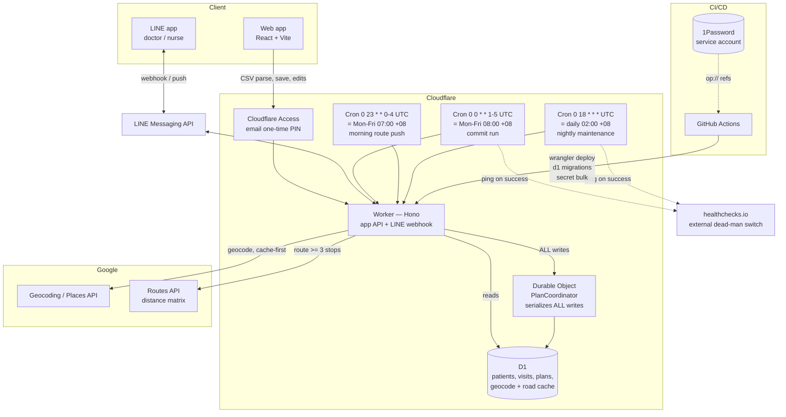
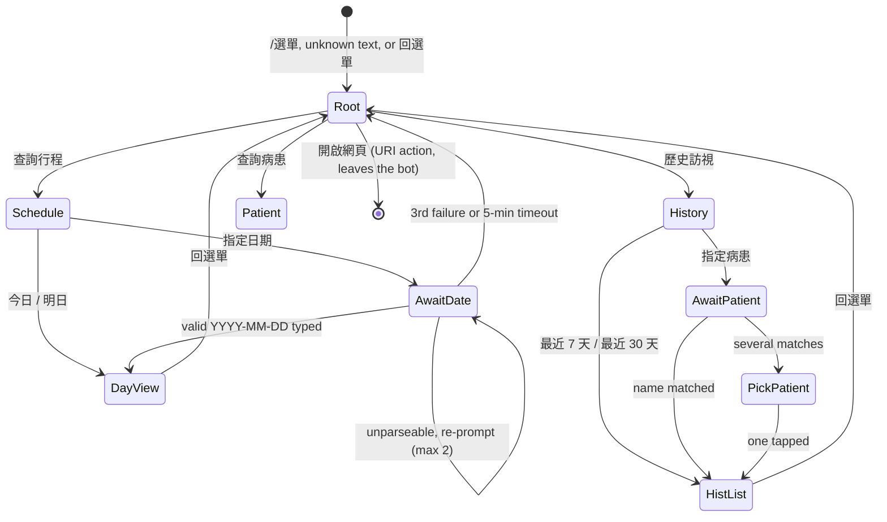

# WhereGo — Home-Visit Scheduling & Routing

Build spec. Last updated 2026-07-25.

**Execution order lives in [`plans/ROADMAP.md`](plans/ROADMAP.md)**, with one execution-ready plan
per phase in [`plans/`](plans/). This document is the specification; where the two disagree, this
one wins and the plan file is wrong.

---

## 1. Rules

| # | Rule | Detail |
|---|------|--------|
| R1 | Prescription cadence | 57 days of medication supply → next visit due **56 days after the previous completed visit**. Cycle 1 is seeded at import (§5.1). |
| R2 | General-diagnosis cap | Max **2 visits per patient in any rolling 28-day window**. |
| R3 | Prescription counts toward R2 | A prescription visit consumes one of the two slots. |
| R4 | General visits are on-demand | The system auto-generates prescription visits only. General visits happen regularly and are added by hand (§5.5). |
| R5 | Daily capacity | Max **8 patients/day**. Single doctor. |
| R6 | Route efficiency | Same-day patients must be geographically tight, and thin days are consolidated rather than opened (§5.3). |
| R7 | Record completeness | A row is **valid** only if all four of 收案日期, 出生日期, 姓名, 地點 parse. Invalid rows are shown for inline correction and are **never written** unless completed (§4). |
| R8 | Language | **Traditional Chinese (zh-Hant) only**. 民國 dates on display, `Asia/Taipei`. |
| R9 | Daily commit job | Mon–Fri **08:00 Asia/Taipei**. Each run commits the **earliest uncommitted working day in `[today + notice_days, today + commit_lead_days]`**, then continues to the next while capacity and time allow. A committed day only ever **grows** — the planner never removes a visit from one or moves one off it (§5.3). |
| R10 | Visit tolerance | Prescription visit should land **±5 days** from due. Outside that it is blocked unless a user explicitly acknowledges the override (§6.2). |
| R11 | No weekend visits | `working_days = Mon–Fri`, minus `holidays`, minus `doctor_absences`. |
| R12 | Authorization | No visit is scheduled on or after a patient's 核定迄日. Hard block. |
| R13 | No clinical data | The importer takes **six columns and never more** (§4). Diagnosis, national ID, care tier, phone and sex are not read and not stored. |
| R14 | Nobody is invisible | Every schedulable patient has, at all times, either a `planned` prescription visit or a **named exception**. The nightly job asserts this and pushes when the count is non-zero (§5.6). The scheduler's failure mode is a patient who is simply on no day; this is the only rule that detects it. |
| R15 | Every alert has a destination | No unattended job fails silently. Every `scheduled()` handler catches, records `plan_runs.status='failed'`, and pushes; every successful run pings an **external** monitor, because an in-Worker heartbeat cannot detect its own non-execution (§5.6). |
| R16 | No fabricated visits | The system never records a visit as having happened on a day the doctor did not work. Auto-completion is suppressed on absence days and is preceded by a confirmation prompt in the channel the users actually read (§5.6). |

---

## 2. Architecture



- **Worker + Hono** — one deployable: app API, LINE webhook, three cron handlers.
- **One Durable Object, `PlanCoordinator`** — **every write goes through it.** D1 has no interactive transactions: you cannot `BEGIN`, read, validate in JavaScript, write, and `COMMIT`. §6.5 requires exactly that, so without serialization two concurrent moves into the same day both pass validation and both commit, producing a 9-visit day that `CAPACITY_EXCEEDED` says can never exist. A single DO gives real serialization, holds the in-memory `PlanState` so `preview` doesn't re-read the world on every drag, and is the natural home for the plan-run lease (§11.4). One DO absorbs this clinic's entire write throughput without effort.
- **D1** — the only datastore. Patients, visits, plans, geocode and road-distance caches, audit log. **Reads may go direct; writes may not.**
- **Cloudflare Access** — email one-time PIN in front of the web app. Two paths are excluded: the LINE webhook and `/healthz`. **A custom domain is mandatory** — Access applications are defined over a hostname in a zone you control, and `*.workers.dev` cannot be placed behind Access. See §10.7 step 0.
- **An external monitor is part of the architecture, not an ops afterthought.** Every detector in a system that lives inside the thing being detected is worthless the moment that thing stops running. The gap audit, the rule audit and the alerting all run in the Worker; `healthchecks.io` is the only observer outside the failure domain (R15).
- **No R2, no KV, no Queues, no Workflows.** The CSV is parsed in memory and discarded; parsed rows live in the browser until Save (§4). Geocoding is a cache-first inline call with a nightly sweep for stragglers. At a few hundred addresses geocoded once and cached, none of the queueing machinery earns its keep. The Durable Object is the one exception, and it is bought for correctness rather than throughput.
- **Start on the Workers Free plan; treat Paid as a one-click escape hatch.** D1 primary region: **APAC**, on either plan.

  This reverses an earlier position in this document, which called Workers Paid *"a hard prerequisite"* and asserted that Held–Karp, the catch-up backfill, the nightly rule audit and the §5.5 ranker were *"all impossible at the free plan's 10 ms."* **That claim was never measured** — none of those four exist yet — and one premise behind it has since changed: Durable Objects used to be Paid-only and are now available on Free, with the restriction that **only the SQLite storage backend is supported**, so `PlanCoordinator` must be declared with `new_sqlite_classes`.

  The free plan's binding limits are **per-invocation, not per-day**, which is why a small clinic's volume does not rescue you from them:

  | | Free | Paid |
  |---|---|---|
  | CPU per invocation | **10 ms**, not raisable | 30 s default, up to 5 min |
  | Subrequests per invocation | **50** | 10,000 |
  | D1 queries per invocation | **50** | 1,000 |
  | Requests/day · storage · crons | 100,000 · 5 GB · 5 | unlimited · 1 TB · 250 |

  Three of WhereGo's workloads are near those ceilings and must be written with them in view: the **nightly planning cron** (CPU), **first-import geocoding** (one subrequest per new address — 50 is roughly 50 patients), and the **weekly `age`-encrypted D1 export** (§11.3, CPU). The planner has a natural escape hatch that costs nothing architecturally: it is capped **per doctor**, so it splits into one invocation per doctor without touching the data model.

  **`limits.cpu_ms` is a Paid-only setting** and is therefore not configured while on Free.

  **This is a decision to revisit with a number, not a belief.** Phase 2 measures the real planner against 10 ms. If it does not fit and per-doctor splitting is not enough, Workers Paid is US$5/month, applies account-wide, and switching requires no redeploy and no code change.

- **AWS (Lambda + DynamoDB) was costed and rejected.** It reaches roughly the same US$0/month — Lambda's 1M requests and DynamoDB's 25 GB are perpetual allowances — but it is rejected on three grounds that are not about price. **`PlanCoordinator` has no drop-in equivalent**, so §6.5's serialization argument would be rebuilt from scratch as conditional writes or a single-consumer queue. **The SPA and API would sit on two origins**, which reintroduces CORS and a second auth path, and forfeits the single-Access-application property §9 relies on. And **§3 is relational** — a `schedulable_patients` view and window queries like *"due in this range, unvisited, under this doctor's cap"* — which is the query shape DynamoDB serves worst. Since Cloudflare Free costs the same US$0 with no migration at all, AWS only becomes interesting if Free provably cannot run the planner; and at that point the fix is US$5, not a re-authored specification.

### Repo layout

```
wherego/
├── .github/workflows/
│   ├── ci.yml               # PR gate — needs zero credentials
│   └── deploy.yml           # 1Password → migrate → secrets → deploy (production)
├── apps/
│   ├── api/                 # Cloudflare Worker (Hono)
│   │   ├── src/routes/      # app API, LINE webhook, cron handlers
│   │   ├── src/coordinator/ # PlanCoordinator Durable Object — the only writer
│   │   └── wrangler.toml
│   └── web/                 # React + Vite SPA, served via Workers Static Assets
├── packages/
│   ├── scheduler/           # PURE TypeScript. No I/O, no CF bindings, no fetch, no Date.
│   │   ├── candidates.ts    # due-date generation, cycle anchoring
│   │   ├── reachability.ts  # which runs can still reach a visit; last-chance (§5.3)
│   │   ├── assign.ts        # 3-class partition + greedy fill + day-open penalty
│   │   ├── route.ts         # Held-Karp exact ATSP for <=8 stops
│   │   ├── rules.ts         # 28-day cap, capacity, window feasibility, authorization
│   │   ├── mutate.ts        # move/swap preview, violations, suggestions
│   │   ├── catchup.ts       # urgent placement — go-live AND ongoing (§5.4)
│   │   └── simulate.ts      # 18-month deterministic replay harness (§5.8)
│   ├── domain/              # zod schemas, PlainDate + ROC math, CSV mapping, shared types
│   └── geo/                 # haversine, bounding-box check
├── migrations/              # D1 SQL migrations
└── docs/PLAN.md
```

**`packages/scheduler` must stay pure** — no Cloudflare runtime, no database, no network. All rule logic lives there and is verified in CI without deploying anything.

**`Date` is banned inside `packages/scheduler`,** enforced by `no-restricted-globals` as a CI failure. This system is one large piece of calendar arithmetic in `Asia/Taipei` executed on UTC-clocked machines; a JS `Date` is an instant, not a date, and `addDays(d, 28)` on a `Date` parsed from an ISO string is UTC-midnight. Any stray `getDate()` / `getDay()` / local format produces a silent off-by-one that surfaces as a visit on the wrong day. `packages/domain` exports a branded `PlainDate = string & { __plainDate }` in `YYYY-MM-DD` with integer day-number arithmetic, and that is the only date type the scheduler sees. This single rule prevents more bugs than any other line in this document.

---

## 3. Data model

```sql
-- Single doctor today, modelled as a table so a second one is a data change.
CREATE TABLE doctors (
  id                  TEXT PRIMARY KEY,
  name                TEXT NOT NULL,
  base_lat            REAL NOT NULL,        -- 大寮衛生所: route start/end
  base_lng            REAL NOT NULL,
  max_visits_per_day  INTEGER NOT NULL DEFAULT 8,
  working_days        TEXT NOT NULL DEFAULT '1,2,3,4,5',  -- ISO weekday numbers
  active              INTEGER NOT NULL DEFAULT 1
);

-- Six columns come from the CSV (§4). Everything else is derived or operational.
-- 身分證號, 性別, 主診斷, 照護階段, 機構簡稱 and 里 are NOT read and NOT stored (R13).
-- There is NO natural key. Every imported row inserts a new patient; the doctor or
-- nurse curates the list by hand (§4, §7). Duplicates are flagged, never merged.
CREATE TABLE patients (
  id                 TEXT PRIMARY KEY,      -- surrogate, the only identity
  -- Required four (R7). All NOT NULL: a record cannot exist without them.
  name               TEXT NOT NULL,         -- 姓名
  birth_mmdd         TEXT NOT NULL,         -- 出生日期 last 4 digits. A disambiguator, NOT a date
  registered_on      TEXT NOT NULL,         -- 收案日期 as ISO
  address_raw        TEXT NOT NULL,         -- 地點 as it appeared, or as typed in review
  -- Optional two.
  clinic_next_visit_on TEXT,                -- 預訪日期 as ISO; seeds cycle 1 (§5.1)
  authorized_until   TEXT,                  -- 核定迄日 as ISO; hard block once passed (R12)
  -- Derived.
  address_source     TEXT NOT NULL DEFAULT 'csv',  -- csv | manual
  address_normalized TEXT,                  -- prefix added, 之/-/鄰 normalized (§4)
  address_formatted  TEXT,                  -- Google's normalized form
  place_id           TEXT,
  lat                REAL,
  lng                REAL,
  geocode_status     TEXT NOT NULL DEFAULT 'pending'
                     CHECK (geocode_status IN
                       ('pending','ok','ambiguous','failed','no_address','manual')),
                     -- 'no_address' and 'failed' are distinct from 'pending': three
                     -- different human actions, so the sweep must not conflate them (§4).
  geocode_confidence TEXT,                  -- ROOFTOP | RANGE_INTERPOLATED | APPROXIMATE ...
  geocode_attempts   INTEGER NOT NULL DEFAULT 0,   -- negative caching (§4)
  last_geocode_at    TEXT,
  notes              TEXT,
  deleted_at         TEXT,                  -- soft delete via the bin icon (§7)
  deleted_by         TEXT,
  delete_reason      TEXT,                  -- duplicate | discharged | deceased | error
  created_at         TEXT NOT NULL,
  updated_at         TEXT NOT NULL,
  CHECK (length(birth_mmdd) = 4),
  CHECK (address_source IN ('csv','manual'))
);
-- The planner reads through this and nothing else.
-- Columns are ENUMERATED deliberately: SQLite expands SELECT * at view-creation time, so
-- under the expand-only migration rule (§11.4) a later ADD COLUMN would silently not appear
-- here, producing a baffling "my new column is undefined in the planner" bug. Any migration
-- touching `patients` must drop and recreate this view.
CREATE VIEW schedulable_patients AS
  SELECT id, name, birth_mmdd, registered_on, address_raw, clinic_next_visit_on,
         authorized_until, address_normalized, address_formatted, place_id, lat, lng,
         geocode_status, geocode_confidence
  FROM patients
  WHERE deleted_at IS NULL AND geocode_status IN ('ok','manual');

CREATE INDEX idx_patients_sched ON patients(deleted_at, geocode_status);
-- Powers the advisory duplicate badge (§4). Not a uniqueness constraint.
-- deleted_at is in the key because the badge query filters on it.
CREATE INDEX idx_patients_dupe  ON patients(name, birth_mmdd, deleted_at);

CREATE TABLE visits (
  id             TEXT PRIMARY KEY,
  patient_id     TEXT NOT NULL REFERENCES patients(id),
  doctor_id      TEXT NOT NULL REFERENCES doctors(id),
  visit_type     TEXT NOT NULL CHECK (visit_type IN ('prescription','general')),
  note           TEXT,                      -- free-text purpose, shown on the LINE card (§8)
  cycle_index    INTEGER,                   -- k, for prescription visits (NULL for general)
  attempt_no     INTEGER NOT NULL DEFAULT 1,-- 2nd+ attempt at the same cycle after a miss
  due_on         TEXT,                      -- NULL for general
  scheduled_on   TEXT NOT NULL,
  sequence_no    INTEGER,                   -- 1..8, stop order within the day
  status         TEXT NOT NULL DEFAULT 'planned'
                 CHECK (status IN ('planned','completed','missed','cancelled','skipped')),
  auto_completed INTEGER NOT NULL DEFAULT 0,-- closed by the nightly job, not by a tap (§5.6)
  locked         INTEGER NOT NULL DEFAULT 0,-- pinned; optimizer plans around it, never moves it
  lock_reason    TEXT,
  skip_reason    TEXT,                      -- required when status = 'skipped'
  override_ack   TEXT,                      -- JSON: violation codes explicitly accepted (§6.2)
  row_version    INTEGER NOT NULL DEFAULT 1,-- optimistic concurrency (§6.5)
  completed_on   TEXT,
  created_at     TEXT NOT NULL,
  updated_at     TEXT NOT NULL
);

-- PARTIAL unique index, not a table constraint. A plain
-- UNIQUE(patient_id, visit_type, cycle_index) would make the two most common non-happy
-- paths structurally impossible: §5.1 ("a missed visit does not advance the cycle — the
-- patient stays due and becomes mandatory on the next run that can reach them") and §6.4
-- ("cancelling does not cancel the obligation — the patient becomes a candidate again")
-- both require a SECOND row for the same (patient, 'prescription', k). Under a table
-- constraint the very next commit run throws on that INSERT.
-- Constraining only LIVE obligations keeps generation idempotent while preserving the
-- missed/cancelled attempt as an auditable row.
CREATE UNIQUE INDEX uq_visits_cycle_live ON visits(patient_id, visit_type, cycle_index)
  WHERE cycle_index IS NOT NULL AND status IN ('planned','completed');
-- General visits carry cycle_index IS NULL and are excluded by the WHERE clause, so they
-- are unconstrained. This is deliberate, not an accident of NULL semantics.

CREATE INDEX idx_visits_day     ON visits(doctor_id, scheduled_on, status);
CREATE INDEX idx_visits_patient ON visits(patient_id, scheduled_on);
CREATE INDEX idx_visits_cycle   ON visits(patient_id, visit_type, cycle_index, status);

-- Denormalized per-day summary for the LINE bot.
CREATE TABLE plan_days (
  doctor_id       TEXT NOT NULL,
  day             TEXT NOT NULL,
  visit_count     INTEGER NOT NULL,
  route_km        REAL,
  route_minutes   INTEGER,
  route_source    TEXT,                     -- haversine | google_routes
  committed       INTEGER NOT NULL DEFAULT 0, -- set by a commit run (§5.3)
  committed_at    TEXT,
  row_version     INTEGER NOT NULL DEFAULT 1, -- bumped on ANY change to the day, so a
                                              -- validation that merely READ this day's
                                              -- capacity has something to guard against
  PRIMARY KEY (doctor_id, day)
);

-- One row per job invocation (§5.3). A run commits one or more days.
CREATE TABLE plan_runs (
  id              TEXT PRIMARY KEY,
  trigger         TEXT NOT NULL,            -- cron | manual | catchup | urgent
  run_date        TEXT NOT NULL,            -- local (Asia/Taipei) date the job fired
  target_days     TEXT,                     -- JSON array; a run may commit several (R9)
  started_at      TEXT NOT NULL,
  lease_until     TEXT,                     -- staleness: a run is reclaimable past this
  finished_at     TEXT,
  status          TEXT NOT NULL CHECK (status IN ('running','ok','failed','skipped')),
  error_text      TEXT,                     -- populated by the top-level catch (R15)
  mandatory_count INTEGER,                  -- last chance
  optional_count  INTEGER,                  -- pulled forward to fill the day
  appended_count  INTEGER,                  -- placed on an earlier committed day (§5.3)
  blocked_count   INTEGER NOT NULL DEFAULT 0, -- last-chance but failed a block rule (§5.3)
  overdue_count   INTEGER NOT NULL DEFAULT 0, -- due < reachable window; urgent queue (§5.3)
  unplaced_count  INTEGER NOT NULL DEFAULT 0, -- mandatory that did NOT fit — alert
  route_km        REAL,
  gap_alert       TEXT,                     -- JSON: working days still uncommitted in range
  stats_json      TEXT,                     -- the decision trace (§5.3)
  UNIQUE(id)
);
-- NOT UNIQUE(target_day). That constraint PREVENTED retries rather than enabling them: a
-- run that inserted its row and then crashed left status='running' occupying the slot
-- forever, and a manual retry violated the constraint. Idempotency comes from
-- plan_days.committed and from uq_visits_cycle_live, which is where it belongs.
CREATE INDEX idx_plan_runs_date ON plan_runs(run_date, status);

-- Audit trail ONLY: no patient data, no file contents, no parsed rows.
-- One row is written when the Worker parses an upload, and updated when the user saves.
CREATE TABLE csv_imports (
  id           TEXT PRIMARY KEY,
  filename     TEXT NOT NULL,
  sha256       TEXT NOT NULL,                -- of the raw uploaded bytes
  byte_size    INTEGER NOT NULL,
  uploaded_by  TEXT NOT NULL,
  encoding     TEXT,                         -- detected: big5 | utf-8 | ...
  row_count    INTEGER,                      -- rows in the file
  valid_count  INTEGER,                      -- valid at parse time
  saved_count  INTEGER,                      -- actually written on Save
  filled_count INTEGER,                      -- rows completed by hand during review
  status       TEXT NOT NULL,                -- parsed | saved | abandoned
  created_at   TEXT NOT NULL,
  saved_at     TEXT
);

CREATE TABLE geocode_cache (
  address_hash      TEXT PRIMARY KEY,        -- sha256 of normalized address
  place_id          TEXT,
  lat REAL, lng REAL,
  address_formatted TEXT,
  confidence        TEXT,
  fetched_at        TEXT NOT NULL
);

-- LINE recipients. Adding the bot creates a pending row; the person is approved by
-- typing a code generated in the web app (§8.1). Unapproved users receive nothing.
CREATE TABLE line_recipients (
  line_user_id    TEXT PRIMARY KEY,
  display_name    TEXT,                       -- self-chosen; NEVER an authenticator
  status          TEXT NOT NULL DEFAULT 'pending'
                  CHECK (status IN ('pending','approved','blocked')),
  doctor_id       TEXT REFERENCES doctors(id),
  approval_code   TEXT,                       -- 6 digits, generated in the web app
  code_expires_at TEXT,                       -- now + 10 minutes
  code_attempts   INTEGER NOT NULL DEFAULT 0, -- 3 strikes, then the code is burned
  approved_by     TEXT,
  approved_at     TEXT,
  first_seen_at   TEXT NOT NULL,
  last_seen_at    TEXT
);

-- Days the doctor does not work, beyond weekends and national holidays: leave, illness,
-- conferences. Absence days are non-working for planning AND suppress auto-completion —
-- without this, a week of leave silently converts ~23 planned visits into ~23 fabricated
-- completed records, each of which then anchors the next 56-day cycle (R16, §5.6).
CREATE TABLE doctor_absences (
  doctor_id TEXT NOT NULL REFERENCES doctors(id),
  day       TEXT NOT NULL,
  reason    TEXT,
  PRIMARY KEY (doctor_id, day)
);

-- LINE webhook replay protection (§8.6). An HMAC signature is valid forever, and LINE
-- legitimately redelivers on timeout. Idempotent status handling stops a repeat of the
-- SAME transition, but not a replayed 完成 arriving after a corrective 未遇.
CREATE TABLE line_events (
  event_id   TEXT PRIMARY KEY,   -- LINE's webhookEventId
  received_at TEXT NOT NULL
);

-- Pairwise road distances, keyed on Place IDs (§5.3). The same patient pairs recur every
-- cycle in a fixed roster, so the matrix warms within weeks and day SELECTION can use road
-- distance rather than haversine — which matters in a district cut by 高屏溪 and 台88.
-- ASYMMETRIC: one-way streets and divided highways mean d(i,j) != d(j,i).
CREATE TABLE road_distances (
  from_place_id TEXT NOT NULL,
  to_place_id   TEXT NOT NULL,
  meters        INTEGER NOT NULL,
  seconds       INTEGER NOT NULL,
  fetched_at    TEXT NOT NULL,
  PRIMARY KEY (from_place_id, to_place_id)
);

-- Deploy log. Exists so the D1 Time Travel bookmark — which IS the rollback plan (§11.3) —
-- lives somewhere durable and queryable rather than only in a GitHub Actions log that
-- expires and is unreadable at 2 a.m.
CREATE TABLE deploys (
  id            TEXT PRIMARY KEY,
  commit_sha    TEXT NOT NULL,
  d1_bookmark   TEXT,
  deployed_at   TEXT NOT NULL,
  deployed_by   TEXT
);

-- Short-lived conversation state for the LINE navigation tree (§8.3). Exists only so a
-- typed reply can be matched to the question the server just asked. Holds NO patient data.
CREATE TABLE line_sessions (
  line_user_id TEXT PRIMARY KEY REFERENCES line_recipients(line_user_id),
  awaiting     TEXT NOT NULL,      -- date_for_schedule | date_for_history | patient_name
  attempts     INTEGER NOT NULL DEFAULT 0,
  expires_at   TEXT NOT NULL,      -- now + 5 minutes
  created_at   TEXT NOT NULL
);

CREATE TABLE holidays (day TEXT PRIMARY KEY, label TEXT);

CREATE TABLE settings (
  key        TEXT PRIMARY KEY,
  value      TEXT NOT NULL,
  tier       TEXT NOT NULL CHECK (tier IN ('structural','operational'))
);
-- STRUCTURAL — read-only in the UI, changed only by migration. These define the
-- last-chance invariant, the freeze horizon and the gap-audit window simultaneously.
-- Editing commit_lead_days from 14 to 10 on a Tuesday afternoon silently orphans every
-- patient whose last chance falls in the discontinuity, and the gap audit then
-- "correctly" reports no gaps over the new, shorter window.
--   cycle_days=56, early_window_days=5, late_window_days=5, general_cap_per_28d=2,
--   commit_lead_days=14, anchor_mode=visit   -- 'registration' is the alternative (§5.1)
--
-- OPERATIONAL — editable on the Settings screen (§7).
--   notice_days=3, min_day_batch=2, day_open_penalty_km=8,
--   due_deviation_km_per_day=1.5,   -- γ: km-equivalent cost of one day off due
--   late_tiebreak_km=0.5,           -- λ: flat km penalty for landing on/after due
--   route_cost_spike_km=5, max_route_minutes=300, horizon_days=120,
--   district_prefix='高雄市大寮區', expected_roster_size=NULL,
--   auto_complete_enabled=1, notifications_enabled=1
--
-- γ and λ are in KILOMETRES so the §5.3 objective is dimensionally consistent — the
-- previous formula mixed km against (undefined units)·days, leaving the single most
-- important tuning knob in the system undefined. Initial values come from the §5.8
-- simulation, not from intuition.
--
-- The whole table is parsed through a zod schema with defaults at load, and load FAILS
-- LOUDLY on an unknown key or an unparseable value. A key/value table of TEXT will
-- otherwise turn one typo into a NaN propagating silently through the cost function.

CREATE TABLE audit_log (
  id TEXT PRIMARY KEY, at TEXT NOT NULL, actor TEXT NOT NULL,
  action TEXT NOT NULL, entity TEXT, entity_id TEXT, detail_json TEXT
);
```

---

## 4. CSV import

Import is a **way to gather records, not a system of record.** Nothing is saved until the user presses Save; after that the patient page (§7) is where everything is maintained.

### The six columns

Source header (Big5, 188 data rows in the sample `居家11506112.csv`):

```
機構簡稱,收案日期,身分證號,出生日期,姓名,性別,主診斷,照護階段,里,預訪日期,核定迄日,地點
```

| Column | Maps to | Required | Blank in sample |
|--------|---------|----------|-----------------|
| 收案日期 | `registered_on` | **yes** | 6/188 |
| 出生日期 | `birth_mmdd` — **last 4 digits only** | **yes** | 32/188 |
| 姓名 | `name` | **yes** | 2/188 |
| 地點 | `address_raw` | **yes** | **129/188** |
| 預訪日期 | `clinic_next_visit_on` — seeds cycle 1 (§5.1) | no | 120/188 |
| 核定迄日 | `authorized_until` — hard block once passed (R12) | no | 8/188 |

The other six columns are **not read**. 主診斷, 身分證號, 性別, 照護階段, 機構簡稱 and 里 never leave the uploaded bytes.

Locate columns **by header name**, and **fail the import loudly if any of the four required headers is missing**. Never fall back to position — column 5 is labelled 性別 but holds phone numbers.

### Date conversion

**ROC → Gregorian, `+1911`,** for all three date columns. Accepts `YYYMMDD` and `YYY/MM/DD`:

```
1150505    → 2026-05-05
115/05/05  → 2026-05-05
```

Strip separators, split as `year = all but last 4`, `month = [-4:-2]`, `day = [-2:]`, add 1911, validate as a real calendar date. Store ISO-8601; **display 民國 everywhere** (§7).

**Sanity bounds — per field, not one global range.** A parsed date outside its field's bounds is treated as unparseable, not as a valid date.

| Field | Bounds | Why |
|-------|--------|-----|
| `registered_on` | `[today − 20y, today]` | You cannot have been enrolled in the future |
| `authorized_until` | `[today − 5y, today + 5y]` | |
| `clinic_next_visit_on` | `[today − 1y, today + 1y]` | It is a near-term appointment, not a projection |

A single `[today − 20y, today + 5y]` window is **not sufficient** and was wrong here: the sample's 收案日期 of **2027-06-11** falls comfortably inside it and would have been accepted. That matters because `registered_on` seeds cycle 1 when 預訪日期 is absent (§5.1), and a future registration date feeds `ceil((today − registered_on)/56)` a negative numerator — arithmetic the formula was never designed for. The 核定迄日 parsing to the year **3067** is caught by either rule.

**`出生日期` — last 4 digits only (MMDD).** The birth year is never read or stored. Strip non-digits, take the last 4, validate as a real month/day. Type it as a 4-character string, not a date.

```
0370421    → 0421
037/04/21  → 0421
```

**Reject, never coerce.** A coerced date schedules a real visit on a wrong day.

### The import flow

```
1. Upload        → Worker decodes and parses in memory, computes sha256, writes a
                   csv_imports audit row (status='parsed'), returns rows to the browser
                   and forgets them. Patient data never touches storage at this step.
                   Bounded: max 2 MB, max 2000 rows — reject beyond, don't truncate.
2. Review        → the SPA renders two blocks (below). The user fills gaps inline.
                   The working set is mirrored to sessionStorage on every keystroke.
3. Save          → valid rows are POSTed back. The handler RE-VALIDATES with the same
                   zod schemas and sanity bounds server-side, then INSERTs. csv_imports
                   is updated to status='saved' with the real counts.
                   Save is INCREMENTAL — save what is ready, keep working on the rest.
4. Redirect      → straight to the patient list, sorted by urgency (§7).
5. Curate        → bin icon soft-deletes duplicates and mistakes, with a confirmation modal.
6. Maintain      → patient details are edited on that page from then on.
```

**Parsed rows live in the browser only.** 188 rows across six fields is well under 50 KB. There is no staging table, no KV, no TTL job, and no window in which unapproved patient data sits in the database.

**But "in the browser" must not mean "in volatile React state."** 129 of 188 sample rows need a hand-typed 地點 (§12), and this screen is used on a phone in the field (§7). iOS Safari evicts background tabs aggressively; one incoming call would destroy a morning of typing, and the recovery — start over — is one nobody performs, so the roster ships partial and nobody records it as an incident. Therefore:

- Mirror the working set to **`sessionStorage`**, keyed by `csv_imports.id`, written on every edit and cleared on Save or explicit discard. This is the same browser-only boundary, just a durable one.
- A **`beforeunload`** guard while unsaved rows exist.
- A persistent 「尚未儲存 N 筆」 banner.
- **Incremental Save.** §4's no-upsert model (every row inserts) already makes partial saves semantically safe, so there is no reason to force one all-or-nothing commit at the end of a long typing session.

**Never trust the client's verdict on validity.** The Save endpoint is behind Access, so this is an integrity problem rather than an external attack surface — but a UI bug, a stale tab, or a half-applied inline edit will otherwise write a malformed `registered_on` or a five-character `birth_mmdd`, and every downstream date computation inherits it. `NOT NULL` catches absence, not nonsense; the `CHECK` constraints in §3 catch the cheap cases; the shared `packages/domain` schemas catch the rest, and the batch is rejected with per-row errors.

### The review screen

Two blocks, both editable:

**Valid block (top).** Rows where all four required fields parsed. Missing 預訪日期 or 核定迄日 shows as an amber cell that can be filled but does not demote the row.

**Invalid block (bottom).** Rows missing at least one required field. Each missing field is an empty input. **The moment a row becomes complete it moves up into the valid block.** Rows left incomplete are never saved and are discarded with the session.

Also on the screen:

- **Live geocoding.** When an address is typed or corrected, geocode on blur and show the resolved address with a green tick, or amber for `APPROXIMATE` or a result outside the 大寮區 bounding box. Typing addresses blind and discovering afterwards that a third of them failed means a second pass over all of them.
- **Duplicate badge.** Any row whose 姓名 + 出生MMDD already exists among non-deleted patients is marked *「可能重複」* with a link to the existing record. **Advisory only** — nothing merges, nothing is blocked. It turns "find the duplicates" into "look at the amber rows".
- **Counts.** Total rows, valid, invalid, filled-by-hand, possible duplicates.

### No matching, no upsert

**Every saved row inserts a new patient.** There is no natural key and no merge. A re-import of the same file produces a second full set of records, and the duplicate badge plus the bin icon are how that is resolved. This is deliberate: the doctor and nurse own the patient list, and the app's job is scheduling, not identity resolution.

### Address normalization

Sample forms: `三隆村興隆路316號`, `上寮(里)路212-28號`, `上寮路225之32號`, `上寮路39號之17`, `上寮里016鄰上寮路212之2號`. All contain 號; only one contains a city or district.

- **Prepend `高雄市大寮區`** to every address (`settings.district_prefix`). All patients are in one district.
- **`X之Y號` and `X號之Y` are DIFFERENT addresses. Do not collapse them.** `上寮路225之32號` is building number 225-32; `上寮路39號之17` is **unit 17 of** building 39. Both forms appear in the sample. Mapping them onto one canonical form sends the doctor to the wrong house for one of them — and Google will geocode the wrong one at `ROOFTOP` confidence, so the confidence gate will not catch it. Normalize `X之Y號` → `X-Y號` and leave `X號之Y` intact as a distinct form.
- **Strip 鄰** (neighbourhood number) — it is not a postal component. 里 embedded inside 地點 (`上寮里016鄰…`) is left in place: R13 forbids importing the *里 column*, not discarding text the clinic wrote into the address field, and it helps disambiguation.
- **Bounds-check the result** against a 大寮區 bounding box; outside → `ambiguous`, not trusted.
- **Show the resolved address before Save.** The review screen already geocodes on blur; render Google's `address_formatted` back so a human sees what was actually matched. Normalization is a heuristic, and the only reliable check on a heuristic here is a person who knows the district.

### Geocoding rules

- **Cache-first, always.** Look up `geocode_cache` by normalized-address hash before calling Google. A re-plan must never hit Google for coordinates. **Subject to the ToS gate below** — if lat/lng caching is time-limited, the cache is keyed by `place_id` and re-resolved on expiry rather than abandoned.
- **Nightly sweep, with negative caching.** Retry patients at `geocode_status = 'pending'`. After **3 failed attempts** (`geocode_attempts`), move to `failed` and stop retrying — a rural lane Google does not have would otherwise generate one API call per night forever, and the exceptions queue would never distinguish a transient failure from an address that needs a human.
- **Three distinct non-success states, because they need three different human actions.** `pending` = not tried yet. `failed` = Google cannot resolve it; someone must correct or pin it. `no_address` = nobody ever gave us one; someone must ask the clinic. Collapsing these into one bucket is how 129 missing addresses become invisible.
- **Editing an address resets geocoding.** Changing `address_raw` sets `geocode_status = 'pending'`, zeroes `geocode_attempts`, and clears `lat`/`lng`/`place_id`, **including for records previously fixed by hand**. A manual pin is only valid for the address it was placed for.
- **Confidence gating.** `APPROXIMATE` → `ambiguous`, not `ok`. Ambiguous patients go to a review queue with a draggable map pin; a manual fix sets `geocode_status = 'manual'`.
- **An address typed during review sets `address_source = 'manual'`,** not `'csv'`. The default only applies to values that actually came out of the file.
- **A patient without valid coordinates is never auto-scheduled.** They appear on the exceptions list — never dropped silently, never placed at (0,0).

**Google Maps Platform ToS is a Phase 0 gate, not a Phase 7 checkbox.** "Geocode once, cache forever, never hit Google again" is load-bearing in §2 and here. Broadly, Place IDs may be stored indefinitely while other Content is subject to a limited caching period. Resolve it before writing the schema: if the answer is time-limited, `geocode_cache.fetched_at` gains a reader and the nightly job gains a re-resolve-from-`place_id` sweep with a budgeted call volume. Today `fetched_at` is written and never read, which is the shape of an unanswered question.

### Big5 decoding

**Bundle a JS decoder and test it against `居家11506112.csv` in Phase 1.** Workers' `TextDecoder` is not guaranteed to support non-UTF-8 labels, and decoder implementations disagree — macOS `iconv -f BIG5` fails on this file where Python's `big5` codec succeeds.

**That disagreement is the diagnosis: the file is almost certainly CP950 / Big5-HKSCS, not strict Big5.** Taiwanese clinical systems emit CP950. A minimal Big5 table will fail on exactly the rare surname characters a patient roster contains — 堃, 淼, 喆, 妘. Use the **WHATWG `big5` index**, which is HKSCS-based and is what browsers implement, and put those four characters in the test fixture.

**Commit a golden-file test, not a manual check.** A synthetic fixture carrying every pathology found in the real file — the year-3067 date, the phone number in the 性別 column, mixed `YYYMMDD` and `YYY/MM/DD`, the `之` / `-` / `號之` address variants, blank 地點, the HKSCS surnames — with the exact expected parse asserted in CI. The date parser is the one component where a bug schedules a real visit on a wrong day.

---

## 5. Scheduling engine

Pure functions in `packages/scheduler`.

### 5.1 Candidate generation and cycle anchoring

**Cycle 1 is seeded at import**, in this order:

```
due(p, 1) = clinic_next_visit_on(p)                                    if present  (預訪日期)
          = registered_on(p) + 56·max(1, ceil((today − registered_on)/56))  otherwise
```

Falling back to a bare `registered_on + 56` is wrong for an existing roster: among the 38 importable rows in the sample the median registration is 78 days old and the oldest is **1,884 days**, which would make that patient 33 cycles overdue on day one. Projecting forward puts everyone on a real future date.

The `max(1, …)` is not cosmetic. Without it, a patient registered *today* gets `ceil(0/56) = 0` and is **due today** — as is anyone registered exactly 56 days ago. The first cycle must always be at least one full cycle out.

**Subsequent cycles anchor to the previous completed visit:**

```
due(p, k+1) = completed_on(previous prescription visit) + 56
```

A candidate exists when the patient has no `planned` or `completed` prescription visit for the current cycle. `uq_visits_cycle_live` (§3) makes generation idempotent while still permitting a second attempt after a miss. `settings.anchor_mode` switches between `visit` (default) and `registration`.

**A missed visit does not advance the cycle.** The patient stays due, goes overdue, and becomes mandatory on the next run that can reach them — or, once no run can, an urgent-placement item (§5.4). The new row carries `attempt_no = 2`; the missed row is retained.

**Newly imported patients are routed through urgent placement, always.** A patient seeded with `due(p,1) < today + commit_lead_days` cannot be reached by any ordinary commit run, because runs only ever look forward. Import is the *continuing* way patients arrive (§4), so this is not a go-live edge case: on day two of operation a nurse imports someone whose 預訪日期 is next Tuesday, and without this they are silently never scheduled. On Save, any patient whose seeded due date falls inside the commit horizon goes straight to the §5.4 urgent-placement queue with a confirmation step.

### 5.2 Feasible windows

```
window(v) = [ due(v) - early_window_days , due(v) + late_window_days ]
            ∩ doctor working days                       -- R11
            ∩ (not in holidays)
            ∩ (not in doctor_absences)
            ∩ [today + 1, today + horizon_days]
            ∩ [.., authorized_until)                    -- R12
```

`early = 5`, `late = 5` (R10) — roughly 7 candidate working days per visit. The fill step weights `|scheduled − due|` and breaks ties toward early; the window is tolerance, not a target.

`horizon_days` (default 120) bounds candidate enumeration. It is **not** the same as `commit_lead_days`: the commit horizon is 14 days, but the §5.5 general-visit ranker and the catch-up planner both need to look much further out.

Resulting interval between actual visits: **51–61 days** against 57 days of nominal supply. Confirmed acceptable — prescriptions carry overlap.

### 5.3 The daily commit job

**Mon–Fri, 08:00 Asia/Taipei. Each run commits the earliest uncommitted working day in `[today + notice_days, today + commit_lead_days]`, then continues to the next while capacity and time allow (R9).**

```
cron = "0 0 * * 1-5"      # UTC
```

Taipei is fixed UTC+8 with no DST, so 08:00 local is 00:00 UTC on the same date and weekdays match. Do not "fix" this with offset arithmetic later.

There is no rolling-horizon re-plan and no separate freeze horizon — the 14-day lead is the freeze.

**Why "earliest uncommitted" rather than a fixed `run_date + 14`.** Under the fixed rule, a run that failed left a hole no later run could ever fill: R9 said each run commits exactly `run_date + 14`, the gap audit detected the hole and alerted, and nothing healed it. Six consecutive failures meant six days permanently unplanned. Making every run pick up whatever is still uncommitted turns the repair path into the normal path — and as a bonus it removes the go-live problem where days `today+1 … today+13` are committed by nobody and the gap audit fires thirteen spurious alerts on day one.

A committed day is still never re-planned. The invariant, stated precisely: **a committed day's visit set only ever grows; the planner never removes a visit from one or moves one off it; stop order may be recomputed.**

#### The last-chance invariant — reachability, not equality

A visit due on `D` may be performed in `window(v)` (§5.2). A run on date `r` can commit days in `[r + notice_days, r + commit_lead_days]`. So:

```
committableDaysFrom(r) = workingDays ∩ [r + notice_days, r + commit_lead_days]
                                       \ alreadyCommitted

lastReachableRunFor(v)  = max { r ∈ workingDays, r ≥ today
                              : window(v) ∩ committableDaysFrom(r) ≠ ∅ }

isLastChance(v, run)    = (run == lastReachableRunFor(v))
```

> **This replaces `due == target − 5`, which was silently unreachable for roughly 40% of the roster.**
>
> `56 = 8 weeks exactly` and `14 = 2 weeks exactly`. Therefore `due(k+1) = completed_on + 56` always lands on the **same weekday** as the previous visit, and `T = run_date + 14` always lands on the same weekday as `run_date`. Mandatory required `T = D + 5`, i.e. `run_date = D − 9`, and `9 mod 7 = 2`:
>
> | Due weekday | `D − 9` | Run exists? |
> |---|---|---|
> | **Mon** | **Saturday** | **no** |
> | **Tue** | **Sunday** | **no** |
> | Wed | Monday | yes |
> | Thu | Tuesday | yes |
> | Fri | Wednesday | yes |
>
> For every patient due on a Monday or Tuesday, the `mandatory` predicate **never evaluated true on any run, ever.** They were only ever `optional`, competed for leftover capacity with no priority, and — worst — the "must be placed, or raise a hard alert" guarantee never fired for them, because `unplaced_count` counts mandatory overflow only. Since the weekday is preserved across cycles, this was a *permanent per-patient property*, and §5.4's catch-up run synchronizes the entire go-live cohort onto a handful of weekdays.
>
> Deriving the constant from settings would not have helped: the bug was the **equality**, not the number. Computing reachability over the real run calendar also absorbs holidays, absences, and any future change to `commit_lead_days` for free.
>
> **Property test, mandatory in Phase 2:** for every due date across a 3-year span and every weekday, there exists **exactly one** run at which the visit is last-chance. Roughly twenty lines, and it would have caught this.

#### Three classes, and every one of them is rule-filtered

```
eligible  = candidates where target ∈ window(v)
                         and respectsCap(visits(v.patient), target)      -- R2+R3
                         and target < authorized_until(v.patient)        -- R12
                         and patient is geocoded

mandatory = eligible where isLastChance(v, run)
optional  = eligible where not isLastChance(v, run)
blocked   = { v : isLastChance(v, run) and v ∉ eligible }
overdue   = { v : no planned visit and lastReachableRunFor(v) < today }
```

| Class | Treatment |
|-------|-----------|
| **Mandatory** | Last chance. Placed first; if it does not fit, `unplaced_count` and a **push** |
| **Optional** | Fills remaining capacity via the cost function below |
| **Blocked** | Last chance but fails a block rule → urgent-placement queue + push. **Never silently dropped** |
| **Overdue** | No run can reach them any more → urgent-placement queue on **every** run, with a count |

> Previously the algorithm read `seed = mandatory on day T` — unconditional, with no `respectsCap`, no `authorized_until`, and no check that `T` was even inside the window. A mandatory patient already holding two hand-added general visits in the surrounding 28 days was placed anyway, producing a state that §6.2 classifies as `CAP_28D_EXCEEDED` — severity **block**, *"can never be applied."* The planner wrote states its own validator declares impossible, the nightly audit then flagged them every night, and there was no repair path, so the dashboard would fill with self-inflicted violations nobody could clear.
>
> The `overdue` class exists because the old two-class partition had **no floor**. A patient whose due date slipped below `target − 5` — through a failed run, a geocoding gap on the wrong day, or capacity overflow — matched neither class and was considered by no future run, forever, with nothing counting them. R14 is the backstop; this is the detector.

#### Consolidation instead of thin days (R6)

At pilot volume the roster generates well under one visit per day. Spread across Mon–Fri that produces five one-stop days a week, where there is no route to optimize and no efficiency to gain. Two mechanisms fix that without hard-coding which weekdays are visit days:

1. **Append to a nearby committed day.** An optional visit may be placed on an already-committed working day inside its window that has spare capacity and is at least `notice_days` (default 3) in the future. This is an append, not a re-plan — the day is re-routed and the count updated. Mandatory visits never append; they go on the target day.
2. **A day-opening penalty.** Placing the first visit on an otherwise-empty day costs `day_open_penalty_km` (default 8) in the objective. The penalty stops applying the moment the day is non-empty and becomes irrelevant as volume grows, so it needs no tuning as the roster expands.

```
cost(v, d) = Δroute(d, v)                        # km
           + γ·|d − due(v)|                      # km per day off due
           + λ·(d ≥ due(v) ? 1 : 0)              # km, breaks ties toward EARLY
           + (visit_count(d) == 0 ? μ : 0)       # km, day-opening penalty
```

**All four terms are in kilometres,** and γ (`due_deviation_km_per_day`) and λ (`late_tiebreak_km`) are settings, not literals. The previous formula weighed km against `(undefined units)·days` with two of its four coefficients undefined — the relative price of "8 km of extra driving" versus "3 days off the due date" is the single most important knob in the system. Initial values come from the §5.8 simulation, not from intuition.

#### Algorithm for one run

```
lease = acquirePlanLease()                 # in the Durable Object; 10-min TTL (§6.5)
if not lease: exit                         # another run is genuinely active

targets = workingDays ∩ [today + notice_days, today + commit_lead_days]
          \ alreadyCommitted                                    # R9, earliest first

for T in targets while time and capacity remain:

    classify candidates into mandatory / optional / blocked / overdue    # all rule-filtered

    emit blocked  → urgent-placement queue + push
    emit overdue  → urgent-placement queue + push                # on EVERY run

    if |mandatory| > capacity(T)  → place what fits;
                                    unplaced_count += rest; PUSH (R15)
    place mandatory on T

    for each v in optional sorted by (remaining_chances asc, |T − due| asc):
        while capacity remains:
            D = { T } ∪ { committed working days in window(v) with spare capacity
                          and ≥ notice_days in the future }
            d* = argmin cost(v, d) over d in D breaking no block rule
            place v on d*                  # appends are counted in appended_count

    route = heldKarp(stops on T)           # exact; re-route any appended day too
    commit day T, mark visits planned, notify

writeDecisionTrace(); gapAudit(); pingExternalMonitor()          # R15
```

**Exact intra-day routing.** ≤8 stops plus a fixed clinic start and end → Held–Karp is `O(2ⁿ·n)` states and `O(2ⁿ·n²)` time: **2,048 states and ~16,384 relaxations**. Microseconds, exactly optimal. (The earlier "`2^8 × 8²` states" conflated states with operations; the conclusion was right, the figure was not.)

**The implementation must not assume a symmetric matrix.** Haversine is symmetric, so an implementation written against it first will look correct — and then quietly break in Phase 7 when fed the Google Routes matrix, which is asymmetric because of one-way streets and divided highways. 大寮區 is cut by 台88 and 高屏溪. Held–Karp handles ATSP without modification; just never write `d(i,j) == d(j,i)`.

**Selection uses road distance where the cache is warm** (`road_distances`, §3), falling back to haversine. In a fixed roster the same patient pairs recur every cycle, so the matrix self-warms within weeks at negligible API cost, and clustering quality improves where the river and the expressway make straight-line distance actively misleading. A committed day with **3 or more stops** is re-optimized once against the live Routes API; with 1–2 stops there is nothing to reorder and the call is skipped.

`max_route_minutes` (default 300) raises a warning, not a block — 8 stops is the hard cap (R5), but a day that fits under it and still takes seven hours is worth flagging.

#### Non-working target days

Holidays and `doctor_absences` are excluded from `targets` at selection time, so the algorithm needs no special case: `targets` is already a list of working days. This replaces a branch that referenced `mandatory` before defining it and never said whether the holiday itself still got a `plan_days` row.

**When a visit's whole window is squeezed, search the window — not backwards only.** The old rule ("the latest working day ≤ `T` that still has capacity") discarded half the legal window. Search all of `window(v)` ∩ working days, preferring the day nearest `due`.

**Chinese New Year is the case that breaks this at scale.** Taiwan's closure routinely runs 7–9 consecutive days, which compresses over a week of mandatory demand onto the last working day before the break — hard-capped at 8. Survivable at 38 patients, fails every February at the roster ceiling. Runs in the two weeks before a multi-day closure must pull optional visits forward rather than discovering the cliff on the day.

Seed the `holidays` table each year from the 行政院人事行政總處 calendar. **A stale table silently books a closed day**, so the nightly job alerts when `max(holidays.day) < today + 90`. Note that the Taiwan calendar also includes 補班 make-up Saturdays, which a day/label table cannot express — model them as an explicit working-day override, not as an absent holiday.

#### Gap audit

**Every run audits the whole committed window**: verify each working day in `[today, today + commit_lead_days]` has a committed `plan_days` row, and alert on any gap.

**The gap audit also runs in the nightly job** (§5.6), on a different schedule. A detector that only executes inside the job it audits is worthless precisely when it is needed: a deterministically failing commit run is detected by nothing, forever.

#### Decision trace

`plan_runs.stats_json` records, per run: the candidate set, each visit's classification and why, the chosen day, the cost breakdown by term, and the reason for **every** non-placement. With no staging environment this trace is the only forensic tool available, and the class of bug described above becomes obvious the first time someone reads one.

### 5.4 Go-live catch-up and overdue recovery

**At go-live, over half the roster is already overdue.** Of the 38 importable sample rows, 20 have a 預訪日期 between 3 and 59 days in the past. They cannot go through the normal path, which only ever targets `today + 14`.

**Urgent placement** (`trigger = 'catchup'` at go-live, `'urgent'` thereafter):

```
1. Collect every patient with no planned prescription visit and due <= today + 14.
2. Sort most-overdue first.
3. Greedily place onto the earliest working days with capacity, respecting
   8/day (R5), the 28-day cap (R2), authorization (R12), and clustering
   geographically via the same cost function.
4. Render the whole proposed schedule for approval.
5. Commit only on confirmation, then let the normal R9 loop continue from tomorrow.
```

At 20 patients and 8/day that clears in about three days of visits.

**This is a permanent code path, not a go-live script.** It is invoked automatically on three triggers, each of which produces a patient no ordinary forward-looking run can reach:

| Trigger | Why the normal path can't help |
|---|---|
| Import Save with `due < today + commit_lead_days` (§5.1) | Runs only look forward; the patient arrived too late |
| 未遇 tapped on or near `due + 5` (§8.6) | Every earlier target is already committed |
| `blocked` or `overdue` emitted by a commit run (§5.3) | By definition unreachable by any future run |

Each lands in the urgent-placement queue with a push, and the placement itself always requires human confirmation — the automatic planner never overrides a rule (below).

**The go-live run has one property worth stating explicitly, because it caused a real bug:** placing 20 overdue patients across three consecutive days synchronizes most of the roster onto those three weekdays *for the life of the system*, since 56 days preserves weekday. That is why §5.3's last-chance test is reachability-based rather than a weekday-sensitive equality, and why the §5.8 simulation seeds a synchronized cohort as one of its scenarios.

**Who approves it, and against what standard.** The catch-up proposal is the highest-consequence human decision in the project and must not be a single 確認 button at the end of a long build. The approval screen shows, per patient: days overdue, the proposed day, the resulting interval since their last visit, and any `warn` violations. It requires the doctor — not the nurse — and the approval is written to `audit_log` with the full proposed set.

**Overdue recovery afterwards.** A visit marked 未遇 on `due + 5`, or a mandatory visit that overflowed capacity, has no legal day left — every earlier target has been committed. Rather than leaving such a patient permanently unschedulable:

- 未遇 sets `status = 'missed'` and raises an **urgent placement** item on the dashboard.
- `PRESCRIPTION_OUT_OF_WINDOW` is an **override** violation (§6.2), not a hard block: a user can place the visit outside ±5 by explicitly acknowledging it, which is recorded in `visits.override_ack` and `audit_log`.
- The automatic planner never overrides. Only a person can.

### 5.5 On-demand general visits (R4)

General visits happen regularly. Adding one asks *"when can I see patient X?"* and gets ranked days, not yes/no:

1. Enumerate working days in range with `visit_count < 8`.
2. Drop any day failing `respectsCap` for that patient, or on/after `authorized_until`.
3. Score by `Δroute` — extra km of inserting into that day's route (exact, via Held–Karp).
4. Return the top 3, cheapest first: *「8/6(四) — 多 2.1 公里，順路」*.

Blocked requests state why, naming the specific blocking dates. Each general visit carries an optional free-text `note` describing its purpose.

### 5.6 Nightly maintenance

```
cron = "0 18 * * *"       # UTC = 02:00 Asia/Taipei, daily
```

1. **Auto-complete — but never on a day the doctor did not work, and never before asking.**

   Every visit with `status = 'planned'` and `scheduled_on < today` becomes `completed`, with `completed_on = scheduled_on` and `auto_completed = 1`, listed on the dashboard for 14 days as *「自動結案」*.

   Without something like this, one forgotten 完成 tap silently removes a patient from all future scheduling — `completed_on` never gets set, the next cycle is never generated, and there is no visible symptom until someone notices the patient has not been seen in months. That reasoning holds. But the consequence, unqualified, is that the system's recorded truth becomes *"every scheduled visit occurred, on the scheduled date"* regardless of reality — and `completed_on` then anchors the next 56-day cycle, so a visit that did not happen produces a next-due date computed from a fictional event. Two guards:

   **(a) Confirm in the channel they actually read.** The 07:00 push (§8.6) leads with yesterday's un-tapped visits as an explicit 「昨日未回報」 confirm/correct prompt. The correction then happens at the moment someone can still remember, rather than depending on the same person who didn't tap 完成 to review a dashboard list that is almost always correct — a habit that does not survive contact with a clinical week.

   **(b) Suppress on absence days (R16).** A visit on a `doctor_absences` day is marked `missed` and routed to urgent placement, never auto-completed. A single week of leave would otherwise fabricate ~23 completed visits and corrupt ~23 cycle anchors in one night, inside a 14-day correction window that a doctor catching up after leave will not open.

   **(c) Escalate repeated auto-completion.** Three consecutive `auto_completed = 1` visits for the same patient raises a dashboard item — that is the signal that reporting has stopped working entirely, not that three visits went smoothly.

2. **Geocode sweep.** Retry patients at `geocode_status = 'pending'`, cache-first, with the 3-attempt cap (§4).
3. **Rule audit.** Run the §6 validator over the whole published schedule (§6.6).
4. **Authorization sweep.** Flag patients whose `authorized_until` passes within 30 days, and block-flag any planned visit that has fallen on or after it.
5. **Session cleanup.** Delete expired `line_sessions` rows (§8.3) and `line_events` older than 7 days.
6. **Gap audit, independently of the commit job** (§5.3). Different schedule, so a transient failure of one is caught by the other.
7. **R14 — the "nobody is invisible" assertion.** Count schedulable patients with no `planned` prescription visit and no named exception (`overdue`, `blocked`, geocode failure, expired authorization, explicitly `skipped`). **Push when non-zero.** Roughly thirty lines, and it is the backstop for every scheduler bug not yet found: every other subsystem announces its problems, but the scheduler's failure mode is a patient who is simply not on any day, and nothing else in the design counts them.
8. **Holiday-table staleness.** Alert when `max(holidays.day) < today + 90`.
9. **Heartbeat (R15).** On success, ping the external monitor. On any exception anywhere in 1–8, write `plan_runs.status='failed'` with `error_text` and push.

### 5.7 The 28-day cap (R2 + R3)

One predicate, used by the planner and by on-demand insertion:

```ts
// Every 28-day window containing `day` must hold at most 2 visits for this patient.
// Checking only windows that START at an existing visit is sufficient — any violating
// window can be slid right until it begins on a visit without losing any visit inside it.
function respectsCap(existing: PlainDate[], day: PlainDate, cap = 2): boolean {
  const all = [...existing, day].sort(asc);
  return all.every(start =>
    all.filter(d => d >= start && d < addDays(start, 28)).length <= cap
  );
}
```

`PlainDate`, never `Date` — see §2. The signature is where this bug class enters, because `addDays(start, 28)` on a `Date` parsed from an ISO string is UTC-midnight, and any local-time accessor downstream shifts it a day.

**Which statuses count.** `existing` is `status IN ('planned','completed')`. A `missed` visit did not happen and a `cancelled` one certainly did not, so neither consumes a slot; `skipped` is an explicit decision not to visit. This is defined once, in a named function in `packages/domain`, used by both the planner and the validator — never re-derived at a call site.

Counts **all** visit types (R3). Property-test with `fast-check` against a brute force over every possible window start.

> **Open question for the clinic, before Phase 2** (§12): is R2 genuinely a *rolling* 28-day window, or is it the NHI 居家醫療 「每月至多2次」 rule, which is per **calendar month**? A rolling implementation of a calendar-month rule blocks legally billable visits and permits some the payer will reject. This changes `respectsCap` fundamentally and is cheaper to ask the clinic's biller now than to learn from a rejected claim.

### 5.8 Simulation harness

Because `packages/scheduler` is pure, the whole system can be replayed offline. Build this in Phase 2, before Phase 3 wires anything to a cron.

Seed N patients with varied registration dates and 預訪日期, then run the daily commit loop day by day across **18 synthetic months**, applying a stochastic 未遇 rate, a general-visit rate, doctor absences, and the Taiwan holiday calendar including a full CNY closure. Assert across the entire run:

- no patient ever goes more than `cycle_days + late_window_days` between completed prescription visits;
- **every patient, on every day, has a `planned` visit or a named exception** (R14);
- no state ever violates a `block` rule;
- actual inter-visit intervals stay within `[51, 61]`;
- every due date is last-chance on **exactly one** run;
- visits/day distribution and km/visit are sane.

Run it at **38, 100 and 330 patients**, and with a synchronized go-live cohort as an explicit scenario. This is how γ, λ and μ get their initial values, and it is the closest thing to a staging environment this architecture allows — the direct payoff of the §2 purity decision. Every scheduling defect found in review would have been caught mechanically here.

**A specific behaviour to check rather than assume:** at 38 patients the roster produces ~0.3 visits/day, so a run whose `mandatory` set is empty starts with `visit_count(T) == 0` and every optional visit pays μ = 8 km to land on `T`. The predictable outcome is that `T` commits empty on most runs while visits pile onto whichever days happened to receive a mandatory seed — clustering by "which day already has a stop" rather than by geography. The mechanism is directionally right (R6); the parameters are guesses until the simulation says otherwise.

---

## 6. Schedule mutations & rule alerts

Every mutation — drag-and-drop, on-demand insertion, catch-up run — goes through **one pure validator**. No second implementation of the rules anywhere.

There is no approval workflow and no request queue: the people who file changes are the same people who apply them (§7). A change is previewed, validated, applied in a transaction, and written to `audit_log`.

### 6.1 Operations

| Op | Meaning |
|----|---------|
| `move` | Visit → different day |
| `swap` | Visit A ⇄ Visit B across two days (required when both days are at 8/8) |
| `reorder` | Change stop order within a day — route cost only |
| `cancel` | Drop a planned visit; the prescription obligation returns to the pool (§6.4) |
| `add` | Insert an on-demand general visit (§5.5) |

### 6.2 Violation catalogue

```ts
type Severity = 'block' | 'override' | 'warn'
//  block    — can never be applied
//  override — refused unless the user explicitly acknowledges; recorded in audit_log
//  warn     — advisory only

interface Violation {
  code: ViolationCode
  severity: Severity
  patientId?: string
  day?: string
  message: string                    // human-readable, names the conflicting facts
  detail: Record<string, unknown>    // machine-readable for the UI
}
```

| Code | Severity | Rule | Triggered when |
|------|----------|------|----------------|
| `CAPACITY_EXCEEDED` | **block** | R5 | Day would hold more than 8 visits |
| `CAP_28D_EXCEEDED` | **block** | R2+R3 | Some rolling 28-day window would hold 3+ visits for that patient |
| `AUTH_EXPIRED` | **block** | R12 | Day is on or after the patient's 核定迄日 |
| `NON_WORKING_DAY` | **block** | R11 | Weekend, holiday, or doctor unavailable |
| `DATE_IN_PAST` | **block** | — | Target day is today or earlier |
| `PATIENT_NOT_GEOCODED` | **block** | — | No reliable coordinates |
| `PATIENT_DELETED` | **block** | — | Patient has been binned (§7) |
| `PRESCRIPTION_OUT_OF_WINDOW` | **override** | R10 | `\|scheduled − due\| > 5` days, either direction |
| `VISIT_LOCKED` | **override** | — | Visit is pinned by an earlier manual change |
| `AUTH_MISSING` | warn | R12 | No 核定迄日 on file — scheduled anyway, flagged for follow-up |
| `PRESCRIPTION_OFF_TARGET` | warn | R10 | Inside ±5 but not on the due date; escalates in tone at 4–5 days |
| `CYCLE_SHIFT` | warn | R1 | Future due dates move — the default under `anchor_mode = visit`; show shifted dates in the preview |
| `CAP_28D_TIGHT` | warn | R2 | Legal but leaves zero headroom |
| `ROUTE_COST_SPIKE` | warn | R6 | Day's route grows past `route_cost_spike_km` |
| `ROUTE_TOO_LONG` | warn | — | Day's estimated duration exceeds `max_route_minutes` |
| `SHORT_NOTICE` | warn | — | Day is close enough that the patient may already have been told |
| `GEOCODE_APPROXIMATE` | warn | — | Coordinates are `ambiguous`, so route delta is unreliable |

Every message names the conflicting facts — not *"invalid — 28-day rule"* but
*「陳美玲 已於 115/07/20 與 115/08/02 安排訪視，115/08/10 將使 115/07/20–115/08/16 期間達 3 次。」*

An `override` violation is presented as a refusal with a single explicit confirmation — *「超過處方期限 5 天，仍要安排？」* — never as a checkbox that can be ticked absent-mindedly.

### 6.3 Validate the outcome, not the steps

```ts
function preview(state: PlanState, m: Mutation): Preview {
  const next = applyAll(structuredClone(state), m)   // apply EVERY part of the mutation first
  return {
    next,
    violations: check(next, affectedPatients(m), affectedDays(m)),
    routeDelta: routeDelta(state, next),
    cascade:    cascade(state, next),                 // future due dates that shift
    alternatives: suggest(state, m),                  // only computed when blocked
  }
}
```

Sequential validation is wrong in both directions — it falsely rejects a swap into a full day (the partner vacates a slot) and falsely accepts a batch where two moves each fit alone but not together.

Property-test the invariant: **no sequence of mutations accepted by `preview` can produce a state that violates any `block` rule.** Fuzz with `fast-check`.

### 6.4 Suggested resolutions

A blocked change never dead-ends. When the only blocking violation is `CAPACITY_EXCEEDED` on day `D`:

```
for each visit w on day D:              # at most 8 candidates
    p = preview(state, swap(v, w))
    if p.violations has no 'block':
        keep (w, p.routeDelta)
return top 3 by routeDelta ascending
```

For `CAP_28D_EXCEEDED`, `AUTH_EXPIRED` or an out-of-window prescription, return the nearest legal days from the §5.5 ranker instead. **Swap is also the wrong fallback for `add`** — an insertion into a full day has no partner day to swap against, so `add` always falls through to the ranker.

**Cancellation semantics:** cancelling a prescription visit does **not** cancel the obligation. The patient becomes a candidate again; if no run can still reach them, they surface as an urgent-placement item (§5.4). To genuinely skip a cycle, mark it `skipped` with a reason.

### 6.5 Concurrency — every write goes through the Durable Object

**D1 has no interactive transactions.** You cannot `BEGIN`, read state, compute in JavaScript, write, and `COMMIT`; D1 offers `batch()` — a fixed statement list with no JS in between — or a single statement. So "re-run the full validation inside the write transaction" is not implementable against D1 directly, and `visits.row_version` alone does not save it: it guards the *one row being moved*, while the invariants that matter are cross-row. Day capacity (R5) and the 28-day cap (R2) both depend on rows nobody is writing. Two concurrent moves into the same day each validate against a 7-visit day and both commit, producing the 9-visit day that `CAPACITY_EXCEEDED` says can never exist — and §6.3's property test passes the whole time, because it runs against the pure package where the race does not exist.

**`PlanCoordinator`, a single Durable Object, is the only writer** (§2). Its single-threaded execution makes read → validate → write genuinely atomic:

- `apply` runs **inside the DO**, re-runs the full validation against freshly read state, and aborts if any `block` appeared since preview. The preview is a UI affordance, never the authority.
- `visits.row_version` and `plan_days.row_version` remain, as defence in depth and to detect a stale client. `plan_days.row_version` is bumped on any change to that day, so a validation that merely *read* a day's capacity has something to guard against.
- **The plan-run lease lives in DO state**, not in a table: `lease_until`, 10-minute TTL, reclaimable once passed. This is what makes "non-stale" (§11.4) a definition rather than a word — a crashed run previously left `status='running'` forever and blocked every future run.
- Reads may bypass the DO and hit D1 directly. Only writes are serialized.
- Every applied change sets `visits.locked = 1`. The optimizer plans around it and never moves it. Users can unlock; recorded in `audit_log`. **The lock auto-clears once `scheduled_on < today`** — otherwise, after a few months of hand-tuning, most visits are locked and the optimizer is decorative.
- Accepted `override` violations are stored on the visit in `override_ack` and logged with the actor.

### 6.6 Continuous rule audit

The same validator runs as a **nightly sweep over the whole published schedule** (§5.6), independent of any mutation — an edited `registered_on` or a lapsed `authorized_until` can retroactively invalidate planned visits. Findings go to the dashboard and are pushed to LINE if they affect the next 7 days.

### 6.7 Alert surface

Live validation during drag-and-drop: drop targets colour green / amber / red *before* release, and an invalid drop is refused with the reason inline. A pre-apply summary panel lists every violation, the route delta per affected day, and any cascade of shifted due dates. Overrides are confirmed here and nowhere else.

**LINE never edits the schedule** (§8). It reports outcomes only:

```
行程異動
陳美玲 — 處方訪視
115/08/06(四) → 115/08/07(五)
```

---

## 7. Web app

React + Vite SPA, served as Workers Static Assets, behind Cloudflare Access. **This is the only surface that mutates anything**, so it must be **mobile-responsive** — it gets opened in the field.

### Access

- **Cloudflare Access, email one-time PIN**, allowlist of clinic addresses. No identity provider to configure and no Google Workspace dependency; adding or removing someone is one line in the Access policy. Session lifetime **30 days** so the login is rare.
- **One permission level.** Doctor and nurse can both do everything — upload, edit patients, move visits, change settings. There is no admin role and no approval step.
- `audit_log.actor` is the email from the Access JWT, so who did what is still recoverable.
- **The LINE webhook path is excluded from Access** — LINE cannot present an Access JWT. It is protected by signature verification instead (§8).

### Localization (R8)

- **No i18n framework** — single locale, literals in 繁體中文 directly in source.
- **`lang="zh-Hant-TW"`** on the document, with a Traditional Chinese font stack first (otherwise shared characters render Simplified glyph variants).
- **Store ISO, display 民國.** One `formatRoc()` / `parseRoc()` pair in `packages/domain`, used by the app, the bot, and the CSV parser. Never format a date inline anywhere else.
- **`Asia/Taipei` everywhere.** Cron expressions in UTC with the offset applied.
- Copy reviewed by a native reader before the pilot.

### Screens

- **Patients** *(the home screen — where Save redirects to)*. Sorted by urgency: overdue first, then next-due ascending. Status column — 逾期 / 已排程 / 待排程 / 地址無法定位 / 授權到期. Inline edit of every field, bin icon with confirmation modal, search, and a 「可能重複」 filter. Editing an address re-geocodes (§4).
- **Import** — drag-drop CSV, encoding banner, the two-block review screen with inline editing and live geocoding, duplicate badges, Save. History shows counts and checksum only.
- **Dashboard** — urgent-placement queue (overdue, blocked, missed), auto-completed visits awaiting confirmation, geocode exceptions split by reason, expiring authorizations, last successful plan run, next 7 days at a glance, and roster reconciliation (below).

  **Capacity, computed rather than asserted.** A 28-day window holds exactly **20** weekdays (4 × 5), not 21, and averages ~19 after national holidays — so 1 doctor × 8/day ≈ **152–160 visits per cycle**, not 168. At 330 patients, prescription demand alone is 330 × (28/56) = **165 visits per 28 days, already over capacity before a single general visit**; if general visits run at one per patient per 56 days (R4 says they happen regularly), per-patient demand doubles and the real ceiling is nearer **150**. Do not display a static constant. Derive the ceiling from working days minus holidays and absences, times 8, times an 80% utilization target, and from the **observed** general-visit rate over the trailing 90 days. Staff will read whatever number is on this screen as real headroom.

  **Roster reconciliation.** The clinic knows roughly how many home-visit patients they have; `settings.expected_roster_size` records it. If the app holds 88 and the clinic says 120, the dashboard says so. This catches the incomplete-import failure, which no amount of technical correctness will.
- **Schedule** — calendar month view with per-day load bars; day detail with the ordered route on a map, drag-to-reorder, drag-to-another-day, lock toggle, validated drop targets, two-visit multi-select for an explicit **swap**. Adding a general visit uses the §5.5 ranked-day picker.
- **Rule audit** — output of the nightly sweep (§6.6).
- **Plan runs** — trigger a run or the catch-up backfill, watch progress, review the proposal before committing.
- **LINE recipients** — pending join requests, **6-digit approval code generation** (§8.1), list of approved recipients, one-tap 封鎖 as the lost-phone response.
- **Doctor absences** — mark leave, illness and conference days. Non-working for planning, and auto-completion is suppressed on them (R16). Marking a day with visits already on it routes them to urgent placement.
- **Export** — pick a date range, download visits as CSV: date, stop order, patient name, address, visit type, note. Covers record-keeping, reporting, and the case where the app is unavailable. **Every export is written to `audit_log`** — it creates an uncontrolled copy of every name and address, and §9's "audit_log on every mutation" would not otherwise cover it, because an export mutates nothing.
- **Settings** — **operational knobs only**: notice days, day-open penalty, γ and λ, route thresholds, horizon, expected roster size, `auto_complete_enabled`, `notifications_enabled`. Structural constants (cycle days, early/late window, commit lead, `general_cap_per_28d`, anchor mode) render **read-only with an explanatory note**; they are changed by migration. `commit_lead_days` alone defines the freeze horizon, the last-chance computation and the gap-audit window simultaneously — editing it from 14 to 10 on a Tuesday afternoon silently orphans every patient whose last chance falls in the discontinuity, and the gap audit then reports no gaps over the new, shorter window.

**Offline fallback.** The Export screen only helps someone who exported *in advance*. The clinic gets a standing practice: a printed or exported week, refreshed every Monday, as the documented procedure when the app is unavailable — not an improvisation discovered during an outage.

---

## 8. LINE bot

LINE Official Account + Messaging API, webhook on the Worker. **Read-only. It never edits the schedule** — the same people who read it have the web app on the same phone.

| Surface | Responsibility |
|---------|----------------|
| **LINE** | Morning route push, an interactive retrieval menu (§8.3), patient lookup, navigation links, mark **完成** or **未遇** |
| **Web app** | Everything else: import, patient curation, move, swap, cancel, settings, export |

### 8.1 Recipient approval

Adding the bot creates a `line_recipients` row with `status = 'pending'` and the LINE display name. The person receives 「尚未開通，請聯絡診所」 and **nothing else** — no schedule, no patient data, no confirmation that any patient exists.

**Approval requires a 6-digit code, not a tap on a display name.**

```
1. The joining person adds the bot; a pending row appears in the web app.
2. Someone at the clinic taps 產生代碼 on that row → 6 digits, 10-minute TTL,
   shown on screen. They read it aloud to the person standing next to them.
3. The person types the code into the bot.
4. Match → status='approved', code cleared, approved_by/at recorded.
   3 wrong attempts → the code is burned and must be regenerated.
```

**A LINE display name is self-chosen and is not an authenticator.** Under one-tap approval the nurse's entire basis for tapping 開通 is a string any LINE user can change in five seconds. Both stated mitigations — approval-as-boundary and a not-searchable OA — fail to the same trivial attack: a forwarded QR code, which §8.1 already concedes happens. A stranger adds the bot as 「林護理師」 during the week a colleague is expected to join, and the nurse approves. The prize is the full roster — names, home addresses, and **the dates the doctor will not be at those homes**. For a population of housebound elderly patients that is a burglary target list, not an abstract PII incident.

The code costs about two hours and binds approval to someone physically present. Everything else about the flow is unchanged: no linking ceremony, no account system, no identity provider.

Set the Official Account to **not searchable** as a second layer.

### 8.2 Message routing

Every inbound event resolves in this order. The first match wins.

```
1. Verify x-line-signature. Fail → 401, nothing parsed.
2. Look up line_recipients. Not 'approved' → reply 「尚未開通，請聯絡診所」 and stop.
3. postback event        → dispatch on the postback data (§8.4)
4. text matches a command (/help, /選單, 選單, help, 開始)
                         → clear any session, reply with the root menu
5. an unexpired line_sessions row exists
                         → interpret the text as the answer to that question (§8.3)
6. anything else         → reply with the root menu, prefixed 「請從下列選項選擇」
```

Step 6 matters: there is no "I don't understand" dead end. Any stray message lands on the menu, which is also the recovery path when someone abandons a flow halfway.

**The rich menu fires the same postbacks** as the Flex buttons — 今日行程 is `a=day&d=today`, not a separate code path. One dispatcher, two entry points.

### 8.3 The navigation tree



**Root menu** — one Flex bubble, buttons stacked vertically:

| Button | Action |
|--------|--------|
| 📅 查詢行程 | postback `a=sched` |
| 📖 歷史訪視 | postback `a=hist` |
| 🔍 查詢病患 | postback `a=patient` |
| 🌐 開啟網頁 | URI action to the web app |

**查詢行程** → a second bubble: 今日 / 明日 / 指定日期.

**指定日期** → the server replies 「請輸入日期，格式 YYYY-MM-DD，例如 2026-07-25」 and writes a `line_sessions` row with `awaiting = 'date_for_schedule'`, 5-minute expiry. The next plain text message from that user is parsed as a date:

- Accept `2026-07-25`, `20260725`, and also 民國 forms `115/07/25` and `1150725` — someone reading a 民國 date off the screen will type a 民國 date, and rejecting it would be a needless dead end.
- Reject anything outside `[today − 1 year, today + 1 year]`.
- On failure, re-prompt with the example and increment `attempts`. After **3 failures**, drop back to the root menu rather than looping.
- The session row is deleted the moment a date resolves.

**Every leaf reply ends with a 回選單 button** (`a=menu`), so no branch dead-ends.

### 8.4 Postback protocol

Buttons carry postback data, never message actions — postback payloads don't appear in the chat transcript, so the conversation stays readable and the parameters aren't user-editable text.

```
v=1&a=<action>[&<param>=<value>...]        # LINE caps postback data at 300 chars
```

| `a=` | Params | Replies with |
|------|--------|--------------|
| `menu` | — | Root menu |
| `sched` | — | 今日 / 明日 / 指定日期 |
| `day` | `d=today \| tomorrow \| YYYY-MM-DD` | That day's schedule (§8.5) |
| `askdate` | `for=sched \| hist` | Date prompt + opens a session |
| `hist` | — | 最近 7 天 / 最近 30 天 / 指定病患 |
| `histr` | `r=7 \| 30` | Completed visits in that window |
| `histp` | `p=<patient_id>` | That patient's visit history |
| `patient` | — | Name prompt + opens a session |
| `visit` | `id=<visit_id>&s=done \| missed` | Status update (§8.6) |

`v=1` is a schema version so an old card sitting in someone's chat history from a previous release fails cleanly rather than being misinterpreted.

**Never trust the payload for authorization.** `p=` and `id=` are re-checked against the sender's approval status and against `deleted_at` on every dispatch. Today every approved recipient may see every patient, but the check belongs in the code from the start, not after a second role appears.

### 8.5 Rendering results

**A day with visits** — Flex carousel, capped at LINE's 12-bubble limit (8 visits plus header and footer fits):

1. **Header bubble** — 民國 date and weekday, visit count, total distance and drive time.
2. **One bubble per visit** — the per-visit card described in §8.6.
3. **Footer bubble** — 「完整路線」 chaining all stops as waypoints, and 回選單.

**An empty day** — a text reply, not a carousel: 「115/08/08(六) 無排程」 with a 回選單 quick reply. A carousel of nothing is worse than a sentence.

**History** — a single Flex bubble listing up to 20 rows (date, patient, 處方/一般, 完成/未遇), newest first, with a footer line pointing at the web app when the result is truncated. Not a carousel — history is scanned, not acted on.

**Patient lookup with several matches** — since duplicate patient records are expected by design (§4), a name search can legitimately return more than one. Reply with a bubble per match showing name, 出生MMDD and address, each with a button carrying `p=<patient_id>`. Never silently pick the first.

### 8.6 Implementation

- **Signature verification first.** Verify `x-line-signature` (HMAC-SHA256 over the raw body with the channel secret) using WebCrypto with a constant-time comparison, and **reject before any parsing**. Also verify the event's `destination` matches the channel ID — which §10.5 already stores and nothing currently reads.
- **Replay protection.** An HMAC signature is valid forever, and LINE legitimately redelivers on timeout. Record `webhookEventId` in `line_events` and drop duplicates; honour `deliveryContext.isRedelivery`. Idempotent status handling (below) stops a repeat of the *same* transition, but not a replayed 完成 arriving after a corrective 未遇 — only event-id dedup catches that.
- **Return 200 promptly.** LINE's delivery timeout is short and a slow chain of D1 round-trips will trigger retries. Do the minimum inline and push the rest behind `ctx.waitUntil`.
- **Reply, don't push.** Every interaction in §8.3 answers with the event's reply token — free, and it keeps the bot silent unless spoken to. Push is reserved for the morning route, alerts and the weekly digest.
- **Rich menu (zh-Hant):** 今日行程 / 明日行程 / 查詢行程 / 歷史訪視 / 查詢病患, all firing §8.4 postbacks.
- **Morning push** — `cron = "0 23 * * 0-4"` UTC = 07:00 Asia/Taipei Mon–Fri. **Leads with yesterday's un-tapped visits as a 「昨日未回報」 confirm/correct prompt** (§5.6), then today's route as a Flex carousel to every approved recipient.
- **Weekly digest** — Monday morning, one message: 「本週訪視 N 人，逾期 M 人，最久未訪視：X (Y 天)，自動結案未確認 Z 件」. About a day of work and the highest-leverage safety feature in the plan: it converts every silent failure mode in this document into a number a clinician will read. A human seeing 「最久未訪視：140 天」 asks a question immediately; a dashboard nobody opens does not.
- **Per-visit Flex card:** stop number, **patient name and road name only** (「陳美玲 · 上寮路」), visit-type badge (處方 / 一般), the visit `note` if present, and a Google Maps deep link. Buttons for 完成 and 未遇.

  **The precise address rides in the link, not in the chat text.** §8.1 states the principle — joining must never grant access to patient names and home addresses — and a morning push of eight full addresses into a conversation that persists forever on personal phones, syncs across devices, and is readable by anyone holding an unlocked phone is the largest actual exposure in the system. Road name preserves the at-a-glance utility; the doctor taps through to navigate anyway.

  **Deep-link on `place_id`, not raw coordinates:** `https://www.google.com/maps/dir/?api=1&destination=<address_formatted>&destination_place_id=<place_id>`. A `RANGE_INTERPOLATED` or `APPROXIMATE` coordinate in a rural 大寮區 lane navigates to the wrong house with no way for the doctor to tell. Note that the 「完整路線」 footer chains stops as waypoints, and the Maps URL API caps waypoints at 9 — 8 stops plus origin and destination is at or over the edge, so it must degrade rather than silently truncate.
- **Status reporting** — 完成 sets `completed_on = scheduled_on` (**not** today; they differ whenever the tap is late, and the difference propagates into every subsequent cycle via the +56 anchor) and is refused on a visit scheduled in the future. 未遇 sets `status = 'missed'` and raises an urgent-placement item (§5.4). One tap, no validation. Both are idempotent: tapping a card twice, or tapping an old card from last week's chat history, must not corrupt state — check the visit's current status and reply 「已於 115/07/24 標記完成」 rather than re-writing it.
- **Session cleanup** — the nightly job (§5.6) deletes expired `line_sessions` rows. Expiry is enforced on read regardless, so a stale row is never acted on.
- **Measure the worst case in Phase 5.** Ten bubbles of Chinese text with buttons and per-stop links can approach LINE's Flex JSON size limit; find out on a synthetic full day, not on a real one.
- **Push quota.** Replies are free; pushes are not, and Taiwan's LINE OA tiers count them **per recipient**. Morning push × ~22 weekdays × N recipients, plus alerts and the weekly digest, is fine at 2–3 recipients and not at 6+. Put a counter behind `notifications_enabled` and confirm the tier before the pilot.
- **No LLM fallback and no free-text query parsing.** The menu tree covers every retrieval path, and a typed query would contain a patient's name — sending that to a third-party model contradicts §9 for no gain over three taps.

*(LIFF is the upgrade path if the Access login on mobile becomes friction, and would replace §8.3's typed-date prompt with a real date picker. Needs a second LINE channel — not for v1.)*

---

## 9. Security & data handling

The importer takes six columns and ignores the other six. The system holds: name, birth MMDD, registration date, home address, coordinates, authorization end date, and visit dates. **No diagnosis, no national ID, no care tier, no phone, no sex, no clinical notes.** No retention policy — records live until binned.

> **The six-column rule is load-bearing.** Importing 主診斷 or 照護階段 would put clinical data on a phone screen, in a chat history, and in a database. Any request to import a seventh column gets weighed against that, not waved through. The two optional columns that were added — 預訪日期 and 核定迄日 — are scheduling dates, not patient characteristics.

Still required:

- **Cloudflare Access** in front of the web app; two paths excluded — the LINE webhook (signature-verified instead) and `/healthz`.
- **Access is enforced in the Worker, not by the route.** Cloudflare Access is a zone-level control over a hostname and path, and a Worker is *also* reachable at `<name>.<subdomain>.workers.dev`, which no Access application covers. If the Worker assumes Access already authenticated the caller, the entire app API is public at that hostname. Therefore: (a) `workers_dev = false` in `wrangler.toml`; (b) a **default-deny middleware** validates the `Cf-Access-Jwt-Assertion` JWT against the team JWKS **and** the `aud` claim on every request — verifying `aud` matters, or an Access JWT from a different Cloudflare team is accepted; (c) exactly two paths are on the unauthenticated allowlist; (d) a CI test asserts the allowlist has exactly those two entries, and that an unauthenticated request to an app route returns 403 under the production config.
- **The local-dev bypass is a production landmine unless it is tested.** `wrangler dev --local` presents no Access JWT, so a bypass is unavoidable. Gate it on `env.ENVIRONMENT === 'local'`, set only in the `[env.local]` wrangler block, and add the CI test above so the bypass cannot ship.
- **LINE recipient approval** (§8.1). An unapproved account receives nothing — the approval check runs before any dispatch, and postback payloads are re-authorized on every event rather than trusted (§8.4). `line_sessions` holds a user id and a pending question, never patient data.
- **The source CSV is discarded after parsing** (§4) — the *file* contains 身分證號, diagnosis and phone even though the database does not. Parsed rows are returned to the browser and never stored server-side until Save, so unapproved patient data has no window in the database at all.
- All credentials in 1Password, injected at deploy time (§10).
- `audit_log` on every mutation: imports, patient edits, soft deletes, reschedules, overrides, lock changes, LINE approvals.
- **Verify the Google Maps Platform Terms** (§3.2.3 caching / §3.2.4 Place IDs) **in Phase 0** — this is a schema gate, not a pre-launch checkbox (§4). Place IDs are storable long-term; other content generally is not. Caching by address hash plus storing `place_id` keeps a re-resolve-from-place_id fallback open. `plan_days.route_km` / `route_minutes` are also stored Routes content and fall under the same answer.

### 9.1 個人資料保護法

This is health-adjacent PII collected by a 醫療機構 in Taiwan. 個資法 applies to names, birth dates and home addresses of medical patients regardless of whether any diagnosis is stored, so the six-column rule reduces the exposure without removing the obligation. Half a page, settled in Phase 0 as a conversation with the clinic rather than legal work:

- **Named controller.** The clinic is the 蒐集者; WhereGo is a tool they operate.
- **Processor list.** Cloudflare (hosting, D1), Google (geocoding, routing), LINE (messaging), 1Password (credentials), GitHub (CI, encrypted backups).
- **Cross-border transfer.** Addresses go to Google; D1 has no Taiwan region and runs APAC. The clinic acknowledges this in writing.
- **Purpose and notice.** What is collected and why, in the terms the clinic already uses with patients.
- **Retention.** Currently "records live until binned," which is not a policy. State one.
- **Deletion.** **The soft-delete-only model cannot honour a 刪除權 request** — `deleted_at` hides a row, it does not remove the name and address. Document a hard-delete procedure: purge the patient row and anonymize their visits to a tombstone id, retaining only the counts the clinic needs for reporting. `delete_reason` (§3) distinguishes a duplicate from a discharge from a deletion request.
- **Incident response.** A lost or stolen phone is an incident: 封鎖 the `line_recipients` row (one tap, §7) and have the conversation deleted. An offboarding staff member gets the same treatment — approval controls who *joins*, and nothing controls what has already left.

---

## 10. Credentials & secret management

Every secret lives in **1Password**. The only credential in GitHub is the service account token that unlocks the rest.

### 10.1 What GitHub holds

| GitHub secret | Scope | Purpose |
|---------------|-------|---------|
| `OP_SERVICE_ACCOUNT_TOKEN` | **Environment** secret on `production` | Read-only access to the `Wherego` vault |

Use an **Environment** secret, not a repository secret — a repository secret is readable by any workflow on any branch.

### 10.2 Deploy-time credentials

| Credential | 1Password ref | Source |
|------------|---------------|--------|
| `CLOUDFLARE_API_TOKEN` | `op://Wherego/credentials/CLOUDFLARE/API_TOKEN` | Cloudflare dashboard → My Profile → API Tokens |
| `CLOUDFLARE_ACCOUNT_ID` | `op://Wherego/credentials/CLOUDFLARE/ACCOUNT_ID` | Cloudflare dashboard |

**Cloudflare API token permissions** — custom token with exactly these:

| Scope | Permission | Level | Needed for |
|-------|-----------|-------|-----------|
| Account | Workers Scripts | Edit | `wrangler deploy` |
| Account | D1 | Edit | `wrangler d1 migrations apply` |
| Account | Account Settings | Read | account resolution |
| User | User Details | Read | `wrangler whoami` |
| Zone | Workers Routes | Edit | only if a custom domain is bound |

Cloudflare has no GitHub OIDC support for API tokens, so this is long-lived. Set an expiry and calendar the rotation (§10.6).

### 10.3 Runtime secrets — pushed into the Worker during deploy

| Secret | 1Password ref | Source | Used for |
|--------|---------------|--------|---------|
| `LINE_CHANNEL_SECRET` | `op://Wherego/credentials/LINE/CHANNEL_SECRET` | LINE Developers → Messaging API channel | Webhook `x-line-signature` verification |
| `LINE_CHANNEL_ACCESS_TOKEN` | `op://Wherego/credentials/LINE/CHANNEL_ACCESS_TOKEN` | LINE Developers (long-lived token) | Reply + morning push |
| `GOOGLE_MAPS_API_KEY` | `op://Wherego/credentials/GOOGLE_MAPS/API_KEY` | Google Cloud Console | Geocoding / Places / Routes |
| `CF_ACCESS_AUD` | `op://Wherego/credentials/CLOUDFLARE_ACCESS/AUD` | Cloudflare Zero Trust → Access app | Validating the Access JWT in the Worker |
| `CF_ACCESS_TEAM_DOMAIN` | `op://Wherego/credentials/CLOUDFLARE_ACCESS/TEAM_DOMAIN` | Zero Trust settings | Access JWKS endpoint |
| `LINE_ALERT_RECIPIENT` | `op://Wherego/credentials/LINE/ALERT_RECIPIENT` | The engineer's own LINE user id | Destination for every job failure (R15) |
| `HEALTHCHECK_PING_URL` | `op://Wherego/credentials/HEALTHCHECKS/PING_URL` | healthchecks.io | External dead-man switch (R15) |
| `BACKUP_AGE_PUBLIC_KEY` | `op://Wherego/credentials/BACKUP/AGE_PUBLIC_KEY` | `age-keygen` | Encrypting the weekly D1 export (§11.5) |

**Two hard rules on the Google key:** it is a *server-side* key that never reaches the browser, and it is **API-restricted** to Geocoding, Places, and Routes only. Interactive maps in the SPA use a separate referrer-restricted browser key — a build-time `var`, not a secret.

### 10.4 Not secrets

In `wrangler.toml`, in git, plain text: D1 `database_id`, the three cron expressions, all `settings` defaults.

### 10.5 1Password vault layout

**One item, one section per service.** A secret reference is `op://<vault>/<item>/<section>/<field>`.

```
Vault: Wherego
└── credentials                    ← a single item; the services are SECTIONS within it
      ├── CLOUDFLARE
      │     ACCOUNT_ID             ← T02 (the zone and the Worker must share it)
      │     API_TOKEN              ← T15; exactly the five §10.2 permissions
      ├── CLOUDFLARE_ACCESS
      │     AUD                    ← T19
      │     TEAM_DOMAIN            ← T19
      ├── GOOGLE_MAPS
      │     API_KEY                ← T12; server-side, API-restricted (§10.3)
      ├── LINE
      │     CHANNEL_SECRET         ← T13 (production)
      │     CHANNEL_ACCESS_TOKEN   ← T13 (production)
      │     CHANNEL_ID
      │     ALERT_RECIPIENT        ← T13; LINE_ALERT_RECIPIENT
      ├── HEALTHCHECKS
      │     PING_URL               ← T14
      └── BACKUP
            AGE_PUBLIC_KEY         ← T14
            AGE_PRIVATE_KEY        ← T14; never leaves the vault, never reaches CI
```

**Every segment is matched literally.** `op://` resolves a section and a field by their exact
labels, so `CLOUDFLARE` is not `Cloudflare` and `ACCOUNT_ID` is not `Account ID`. A mismatch is not
a warning — it is an empty value at deploy time, reported against the *workflow step* rather than
the field, which is why §11.2's references are verified by resolving them (T15) rather than by
reading them.

The single-item shape is deliberate and was chosen over one item per service: it is what exists in
the vault. The cost is that all twelve fields share one item history, so per-service rotation
(§10.6) is audited at the item level.

### 10.6 Rotation & hygiene

- Expiry on the 1Password service account token; rotate on a schedule.
- Rotate `CLOUDFLARE_API_TOKEN` and `LINE_CHANNEL_ACCESS_TOKEN` on staff change.
- Enable GitHub **secret scanning + push protection**.
- Never `echo` a secret and never pass one as a command-line argument (visible in `ps`). Env vars or stdin only — see the `jq` pattern in §11.2.

### 10.7 One-time manual setup (not in CI)

0. **Bind a custom domain to the Worker.** The app is **`wherego.storium.work`** — a subdomain of the `storium.work` zone, which is registered in Cloudflare on the owner's account and serving through Cloudflare nameservers. The apex is in use by something else and is left alone. This hostname is decided **once**, here, and is then referenced rather than re-chosen: it is the Access application's domain, the LINE production webhook host, `APP_HOST` in the `production` GitHub Environment, and the Worker's custom domain. **The zone and the Worker must sit in the same Cloudflare account**, or the Workers Route cannot be created and the Access application has no hostname to sit in front of. Cloudflare Access applications are defined over a hostname in a zone you control, and **`*.workers.dev` cannot be placed behind Access**, so the entire authentication design depends on this. Set `workers_dev = false`.
1. Create the D1 database in the **APAC** region; record the id in `wrangler.toml`. Confirm the account's Workers plan and record it — **Free is the intended starting plan** (§2), and the plan in force decides whether `limits.cpu_ms` is configurable and whether `PlanCoordinator` must be SQLite-backed.
2. Create the Cloudflare Access application over the app route, with an email-OTP policy and the clinic allowlist; **exclude the LINE webhook path and `/healthz`**; record `aud` + team domain.
3. Create the LINE Messaging API channel; set the webhook URL; disable auto-reply; set the Official Account to not-searchable; issue the long-lived channel access token. Confirm the Taiwan push-message tier.
4. **Create a second, free LINE Messaging API channel as the development OA**, with the engineer's own account as its sole approved recipient. A channel has exactly one webhook URL, so without this, pointing a `cloudflared` tunnel at it takes the *production* bot offline for the duration — which across Phase 5 is most of it. Ten minutes, no cost, and it removes the worst workflow constraint in the plan.
5. Create the Google Cloud project; enable Geocoding/Places/Routes; create the API-restricted server key; set a billing budget alert. **Resolve the Maps ToS caching question** (§4, §9) before the schema is finalized.
6. Create the healthchecks.io check for each cron and record the ping URLs. Generate the `age` backup keypair.
7. Populate the `Wherego` vault; create the read-only service account; add its token as the `production` GitHub Environment secret; **add a required reviewer to the `production` Environment** — one checkbox, and the only human gate between `git push` and a live clinical scheduler with no staging.
8. Seed `doctors` with the clinic's base coordinates, `holidays` for the current year, and `settings.expected_roster_size`.
9. One manual `wrangler deploy` so `wrangler secret bulk` has a target on the first CI run.

---

## 11. CI/CD — GitHub Actions

**One environment: production.** No staging — see §11.3.

`ci.yml` runs on every PR and **needs no credentials**: because `packages/scheduler` is pure, the whole constraint engine is verified without touching Cloudflare, Google, LINE, or 1Password.

### 11.1 `ci.yml`

```yaml
name: CI
on:
  pull_request:
  push:
    branches: [main]

jobs:
  verify:
    runs-on: ubuntu-latest
    steps:
      - uses: actions/checkout@v4
      - uses: pnpm/action-setup@v4
      - uses: actions/setup-node@v4
        with:
          node-version: 24
          cache: pnpm
      - run: pnpm install --frozen-lockfile
      - run: pnpm typecheck
      - run: pnpm lint          # incl. no-restricted-globals: Date banned in scheduler
      - run: pnpm test          # unit + fast-check property tests + golden CSV fixture
      - run: pnpm test:sim      # §5.8 simulation at 38 / 100 / 330 patients
      - run: pnpm test:worker   # @cloudflare/vitest-pool-workers — real Miniflare D1
      - run: pnpm build
```

`test:worker` runs the actual Worker against real Miniflare D1 inside CI: migrations, route handlers, a **signed** LINE webhook body, the import Save path, the Access default-deny allowlist assertion, and the cron handlers seeded with synthetic patients. It needs no credentials, so it preserves this workflow's best property. Without it, `pnpm test` covers the one layer that was already provably safe and none of the layers that are not — and the cron handlers are the only unattended code in the system with the highest patient consequence.

Pin every action to a **full commit SHA**, not a tag. `actions/checkout@v4` is a mutable ref, and `deploy.yml` holds a token that can rewrite the production Worker.

### 11.2 `deploy.yml`

```yaml
name: Deploy
on:
  # NOT `push: main`. ci.yml and deploy.yml were independent workflows on the same
  # trigger, so a merge with failing property tests deployed the broken scheduler
  # straight to production — no staging, and the blast radius is a real patient's
  # medication. Deploy now runs only after CI has gone green on that same commit.
  workflow_run:
    workflows: [CI]
    types: [completed]
    branches: [main]
  workflow_dispatch:

jobs:
  deploy:
    if: github.event_name == 'workflow_dispatch' ||
        github.event.workflow_run.conclusion == 'success'
    runs-on: ubuntu-latest
    environment: production          # gates OP_SERVICE_ACCOUNT_TOKEN + required reviewer
    permissions:
      contents: read
    concurrency:
      group: deploy-production
      cancel-in-progress: false          # never cancel a half-applied migration

    steps:
      - uses: actions/checkout@v4
      - uses: pnpm/action-setup@v4
      - uses: actions/setup-node@v4
        with:
          node-version: 24
          cache: pnpm
      - run: pnpm install --frozen-lockfile

      # BUILD BEFORE SECRETS. `pnpm build` runs arbitrary code from the dependency tree
      # — Vite plugins, esbuild, any transitive postinstall. With the 1Password step
      # above it, one compromised dev-dependency reads the LINE channel access token and
      # the Cloudflare API token straight out of the environment. The web build needs no
      # secrets: the browser Maps key is a build-time var.
      - name: Build web SPA
        run: pnpm --filter web build

      # export-env: false — secrets become step OUTPUTS, consumed only where needed,
      # rather than living in $GITHUB_ENV for every subsequent step.
      - name: Load secrets from 1Password
        id: op
        uses: 1password/load-secrets-action@v2
        with:
          export-env: false
        env:
          OP_SERVICE_ACCOUNT_TOKEN:  ${{ secrets.OP_SERVICE_ACCOUNT_TOKEN }}
          # Every segment is case- and spelling-exact — see §10.5. A typo here resolves
          # to an empty string and fails as a wrangler error naming this step, not the field.
          CLOUDFLARE_API_TOKEN:      op://Wherego/credentials/CLOUDFLARE/API_TOKEN
          CLOUDFLARE_ACCOUNT_ID:     op://Wherego/credentials/CLOUDFLARE/ACCOUNT_ID
          GOOGLE_MAPS_API_KEY:       op://Wherego/credentials/GOOGLE_MAPS/API_KEY
          LINE_CHANNEL_SECRET:       op://Wherego/credentials/LINE/CHANNEL_SECRET
          LINE_CHANNEL_ACCESS_TOKEN: op://Wherego/credentials/LINE/CHANNEL_ACCESS_TOKEN
          CF_ACCESS_AUD:             op://Wherego/credentials/CLOUDFLARE_ACCESS/AUD
          CF_ACCESS_TEAM_DOMAIN:     op://Wherego/credentials/CLOUDFLARE_ACCESS/TEAM_DOMAIN

      # With no staging environment, this bookmark IS the rollback plan — so it must
      # not live only in a CI log that expires and is unreadable at 2 a.m. It goes to
      # the job summary, an artifact, and a `deploys` row in D1 itself.
      - name: Record D1 restore point
        id: tt
        run: |
          BM=$(pnpm --filter api exec wrangler d1 time-travel info wherego --json \
               | jq -r '.bookmark')
          echo "bookmark=$BM" >> "$GITHUB_OUTPUT"
          echo "### D1 restore point: \`$BM\` (commit ${GITHUB_SHA})" \
               >> "$GITHUB_STEP_SUMMARY"
          echo "$BM" > d1-bookmark.txt
      - uses: actions/upload-artifact@v4
        with: { name: d1-bookmark, path: d1-bookmark.txt, retention-days: 90 }

      - name: Apply D1 migrations
        run: pnpm --filter api exec wrangler d1 migrations apply wherego --remote

      # Secrets BEFORE code: a release introducing a new secret never runs without it.
      # Built with jq and piped via stdin so no secret appears in argv.
      - name: Sync runtime secrets to Worker
        run: |
          jq -n \
            --arg gmk  "$GOOGLE_MAPS_API_KEY" \
            --arg lcs  "$LINE_CHANNEL_SECRET" \
            --arg lat  "$LINE_CHANNEL_ACCESS_TOKEN" \
            --arg aud  "$CF_ACCESS_AUD" \
            --arg team "$CF_ACCESS_TEAM_DOMAIN" \
            '{GOOGLE_MAPS_API_KEY:$gmk, LINE_CHANNEL_SECRET:$lcs,
              LINE_CHANNEL_ACCESS_TOKEN:$lat,
              CF_ACCESS_AUD:$aud, CF_ACCESS_TEAM_DOMAIN:$team}' \
          | pnpm --filter api exec wrangler secret bulk

      - name: Deploy Worker + static assets
        run: pnpm --filter api exec wrangler deploy

      # /healthz is on the Access BYPASS policy (§10.7 step 2). Without that, Access
      # answers an unauthenticated request with a 302 to the login page — `curl -f`
      # does not fail on 3xx, so curl exits 0 with an HTML body and `jq -e` dies with a
      # parse error on every single deploy.
      # Asserting the commit SHA, not just ok:true — otherwise this passes against the
      # PREVIOUS version whenever a deploy silently no-ops.
      - name: Smoke test
        env:
          APP_HOST: ${{ vars.APP_HOST }}
        run: |
          curl -fsS --fail-with-body --retry 5 --retry-delay 3 \
            "https://${APP_HOST}/healthz" \
          | jq -e --arg sha "$GITHUB_SHA" '.ok == true and .commit == $sha'
```

`APP_HOST` is a GitHub Environment **variable**, not a secret, and is passed via `env:` rather than interpolated into the shell script. `/healthz` returns `{ok, version, commit}` and nothing else.

### 11.3 `backup.yml` — weekly encrypted D1 export

```yaml
on:
  schedule: [{ cron: "0 19 * * 0" }]     # Sunday 03:00 Asia/Taipei
  workflow_dispatch:
```

`wrangler d1 export wherego --remote`, encrypted with `age` against `BACKUP_AGE_PUBLIC_KEY` (private key in 1Password), uploaded as a 1-year-retention artifact.

D1 Time Travel is a 30-day window and nothing else exists today. An accidental `DELETE` noticed on day 31, a billing lapse, or a Cloudflare-side incident loses the roster permanently — and the §7 Export screen covers **visits**, not `patients`, which is the irreplaceable table: it was reconstructed by hand from a CSV missing 69% of its addresses. This is CI-side and does not contradict §2's "no R2".

### 11.4 Controls replacing a staging environment

1. **The pure scheduler package** — the constraint engine is fully verified in CI with no deployment, including the §5.8 simulation.
2. **Worker-level integration tests in CI** (`test:worker`, §11.1). Recovers most of what staging would have given, with no credentials.
3. **Local E2E with Miniflare.** `wrangler dev --local` gives real D1. Migrations, the import flow, and the LINE webhook run locally against synthetic patients — the tunnel points at the **dev LINE channel** (§10.7 step 4), never at production. **Never put test patients in production D1.**
4. **Zero-traffic preview versions, from Phase 0 — not Phase 7.** `wrangler versions upload` → smoke-test the preview URL → `wrangler versions deploy` to promote. This is the closest thing to staging the architecture allows and it costs nothing; adopting it in the final phase means the entire build happens without it, which is backwards. The risky deploys are the early ones.
5. **D1 Time Travel** — 30-day point-in-time restore, using the bookmark recorded pre-migration. **Read the restore playbook below before using it.**
6. **Weekly encrypted export** (§11.3) for anything older than 30 days.
7. **Notification kill-switch** — `notifications_enabled` toggled off before risky work. Local dev uses the dev channel and cannot reach the clinic.

#### Restore playbook

**`wrangler rollback` first, always.** It reverts code only and loses nothing. Time Travel is the last resort, and the plan must be honest about what it costs:

- **It restores the whole database.** Every 完成/未遇 mark, patient edit, and visit committed since the bookmark is discarded.
- **It interacts badly with auto-completion.** The nightly job will re-close the reverted `planned` visits as `completed`, so a restore silently converts every lost 未遇 into a false 完成 — in bulk, and exactly the corruption R16 exists to prevent. **Set `auto_complete_enabled = 0` before restoring** and reconcile by hand.
- State the data-loss window to the clinic before restoring, not after.

### 11.5 Deployment rules

- **Migrations are expand-only.** They run before the new code, so every migration must be backward-compatible with the currently running Worker. Drops and renames are two-release operations; D1 has no transactional DDL rollback. **A migration touching `patients` must drop and recreate `schedulable_patients`** (§3).
- **Never deploy during a plan run.** The runner holds a lease in the `PlanCoordinator` Durable Object (§6.5) and refuses to start while a live one is held. **Stale is defined**: a lease whose `lease_until` has passed — 10 minutes — is reclaimable. A crashed run previously blocked every future run forever.
- **`concurrency` with `cancel-in-progress: false`.**
- **Deploy runs only after CI passes** on the same commit, behind a required Environment reviewer (§11.2).
- **Rollback** is `wrangler rollback` for code, `wrangler d1 time-travel restore` for data. Neither is automatic; see the restore playbook.
- **Preview versions from Phase 0**, not Phase 7: `wrangler versions upload` → `versions secret put` → smoke-test → `wrangler versions deploy`.

---

## 12. Delivery phases

| Phase | Deliverable | Est. |
|-------|-------------|------|
| **0 — Foundations** | **Custom domain bound to the Worker** (domain already in Cloudflare; confirm the zone and the Worker share an account). Monorepo, wrangler config, Workers **Free** plan confirmed, D1 APAC + migrations, Cloudflare Access with email OTP and two excluded paths, default-deny JWT middleware, `workers_dev = false`. `Wherego` vault + service account, `production` Environment with a required reviewer, `ci.yml` gating `deploy.yml`, bootstrap deploy, green production deploy. Miniflare loop. **Dev LINE channel. healthchecks.io. Preview-version flow. Google Maps ToS resolved. 個資法 conversation with the clinic (§9.1).** | **1 w** |
| **1 — Import** | CP950/Big5-HKSCS decode (**golden fixture in CI**), ROC parsing with per-field sanity bounds, six-column mapping, address normalization preserving 之-form distinctions. Parse-in-memory → rows to the browser → two-block review screen with inline editing, **sessionStorage durability + incremental Save**, live geocode-on-blur, duplicate badges → server-side re-validation → Save → redirect. `csv_imports` rows. Cache-first geocoding, three exception states, negative caching. | **2.5 w** |
| **2 — Scheduler core** | `packages/scheduler`, pure: `PlainDate` + lint ban, cycle anchoring incl. the 預訪日期 seed, windows, **reachability-based last-chance**, the four-class rule-filtered partition, cap predicate, authorization, day-open penalty + append-to-committed-day fill, exact **ATSP** Held–Karp, urgent placement, **the §6 validator**, and **the §5.8 simulation harness**. Property tests incl. *every due date is last-chance on exactly one run*. No UI, no DB. | **3 w** |
| **3 — Jobs** | `PlanCoordinator` Durable Object + lease. Commit cron `0 0 * * 1-5` with the R9 earliest-uncommitted rule, gap audit in **both** the commit and nightly jobs, non-working-day handling, blocked/overdue/unplaced alerts, decision trace. Nightly `0 18 * * *`: auto-complete with absence suppression, geocode sweep, rule audit, authorization sweep, **R14 assertion**, holiday staleness, heartbeat ping. Urgent placement with approval. Worker-level integration tests. | **2 w** |
| **4 — Web app** | Patients (urgency sort, inline edit, bin + confirmation + reason, duplicate filter), dashboard with computed capacity and roster reconciliation, calendar + map day view, drag-and-drop with live validation, ranked-day picker, absences screen, CSV export with audit, split settings, LINE recipients + code generation | **3.5 w** |
| **5 — LINE bot** | Channel setup, signature verification + replay protection, code-based approval flow, rich menu. The §8.3 navigation tree: root menu, schedule and history branches, `line_sessions` typed-date and patient-name prompts, versioned postback dispatcher, day carousel / empty-day / history / multi-match renderers, 回選單 on every leaf. Flex cards (road name + place_id links), morning push with 「昨日未回報」, **weekly digest**, idempotent 完成/未遇 | **2 w** |
| **6 — Mutation surfaces** | Swap partner search, cheapest-day suggestions, override confirmation flow, DO apply-path wiring, rule-audit screen, mobile-responsive day view | **1 w** |
| **7 — Hardening & pilot** | Routes API + road-distance cache for 3+ stop days, audit log coverage, load test at 2× patients with a CPU budget assertion, backup restore drill, go-live catch-up run, pilot with real data | **2 w** |

**Roughly 17 weeks for one engineer** — call it **4 months**.

> The previous headline of "roughly 7 weeks" was wrong twice over. First arithmetically: the original table summed to `2 + 7.5 + 5 + 5 + 10 + 5 + 4 + 5 = 43.5` working days, which is **8.7 weeks**, not 7. Second in substance — Phase 2 carried the entire scheduler *and* a 17-code validator with cascade and suggestion engines under a one-week estimate, and Phase 4's drag-and-drop calendar with live per-drop-target validation is a fortnight by itself.
>
> This matters more than a slipped date. The pilot is a commitment to a clinic with real patients, and a plan running 2× over lands go-live in a rush — which is precisely when the catch-up run (§5.4), the highest-consequence human decision in the project, gets approved without careful review. That is the opening move in both reviewers' pre-mortems.
>
> Scope was deliberately **not** cut. The §8.3 navigation tree stays.

**Build the §6 validator in Phase 2, not Phase 6.** It is pure logic over the same `PlanState`, shares the 28-day-cap predicate with the planner, and the nightly audit needs it. Phase 6 only wires up the surfaces.

**Build the scheduler before the UI.** It is fully testable with a fixture CSV of synthetic patients and zero cloud infrastructure.

### Known data gaps

**129 of 188 rows in the sample have no 地點, so the file yields 38 patients.** With inline editing that is now a fixable problem rather than a lost one — but it is a typing job, and the missing addresses are concentrated in the clinic's own records: of the 147 rows tagged 大寮衛生所, only 30 have an address (20%). **Ask the clinic for an export that includes 地點.** That conversation is cheaper than any amount of data entry, and it is their own system dropping the column.

**The last 41 rows look like a different source.** They have no 機構簡稱, 主診斷 on 1 row and 照護階段 on 2, but 地點 on 29 of 41 (71%) — the inverse fill profile of the main block. Establish what that section is before treating the file as one roster.

**Two of the 38 have an expired 核定迄日** and are therefore unschedulable under R12 until the date is corrected on the patient page. One 核定迄日 elsewhere in the file parses to the year 3067; the sanity bounds in §4 reject it.

**32 of 188 rows have no 出生日期, and R7 makes it required.** Those rows cannot be saved until someone finds a birth month and day — for a field with **no scheduling function**, used only by the advisory duplicate badge. The rule stands as written; the cost is recorded here so the clinic can decide whether to supply the values or relax the requirement.

### Open questions for the clinic

These block confident execution and are all cheaper to ask than to discover.

| # | Question | Blocks |
|---|---|---|
| 1 | Is R2 a **rolling** 28-day window, or the NHI 「每月至多2次」 **calendar-month** rule? A rolling implementation of a monthly rule blocks billable visits and permits rejectable ones. | §5.7, Phase 2 |
| 2 | Is a **61-day** interval genuinely acceptable against 57 days of supply? Every last-chance placement lands at exactly `due + 5` **by construction** — the worst case is the *default* for that class, not a rare edge. And does 慢性病連續處方箋 constrain how **early** a re-prescription visit may occur? The λ term deliberately biases early and nobody has checked whether early has a limit. | §5.2, Phase 2 |
| 3 | **What are the last 41 rows?** If they are a second clinic, a historical roster, or discharged patients, importing them creates 29 patients who should not be scheduled — and with no upsert, un-importing is 29 manual soft-deletes. | Phase 1 |
| 4 | **Will the clinic re-export with 地點?** If not, go-live scope is 38 patients **plus a data-entry project of ~120 addresses**, which is days of someone's time and needs a named owner. | Phase 1 |
| 5 | How does the doctor want **leave** handled — pre-blocked dates, or reschedule reactively? | §5.6, Phase 3 |
| 6 | How many **LINE recipients**, and on which Taiwan OA tier? | Phase 5 |
| 7 | Who is the named **個資 controller**, and what retention rule do they want? | §9.1, Phase 0 |
