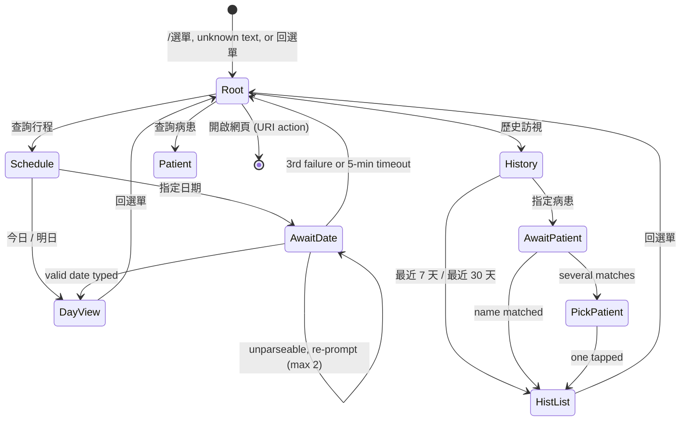

# Phase 5 — LINE bot

**Estimate** 2 weeks · **Depends on** Phase 4 · **Blocks** Phase 7
**Spec** [`../PLAN.md`](../PLAN.md) §8

---

## Goal

The read-only surface. Morning route push, an interactive retrieval menu, patient lookup,
navigation links, and 完成 / 未遇.

**LINE never edits the schedule.** The same people who read it have the web app on the same phone.

---

## Prerequisites

- Phase 4 complete — the recipients screen generates approval codes (P4-09).
- **All development happens against the dev channel** (P0-08). A channel has exactly one webhook
  URL; pointing a tunnel at production takes the production bot offline for the duration, which
  across this phase is most of it.
- Open question 6 answered: how many recipients, on which Taiwan OA tier? It gates P5-12.

---

## Tasks

### P5-01 · Signature verification, replay protection, prompt 200

**Verify first, parse never before.**

- `x-line-signature`: HMAC-SHA256 over the **raw body** with the channel secret, via WebCrypto,
  **constant-time comparison**, rejected **before any parsing**.
- Verify the event's `destination` matches the channel ID — §10.5 already stores it and nothing
  currently reads it.
- **Replay protection.** An HMAC signature is valid forever, and LINE legitimately redelivers on
  timeout. Record `webhookEventId` in `line_events` and drop duplicates; honour
  `deliveryContext.isRedelivery`. Idempotent status handling stops a repeat of the *same*
  transition, but **not a replayed 完成 arriving after a corrective 未遇** — only event-id dedup
  catches that.
- **Return 200 promptly.** LINE's delivery timeout is short and a slow chain of D1 round-trips
  triggers retries. Minimum inline; the rest behind `ctx.waitUntil`.

Spec: §8.6.

### P5-02 · Recipient approval — the 6-digit code

```
1. The joining person adds the bot; a pending row appears in the web app.
2. Someone at the clinic taps 產生代碼 → 6 digits, 10-minute TTL, shown on screen.
   They read it aloud to the person standing next to them.
3. The person types the code into the bot.
4. Match → status='approved', code cleared, approved_by/at recorded.
   3 wrong attempts → the code is burned and must be regenerated.
```

An unapproved account receives 「尚未開通，請聯絡診所」 and **nothing else** — no schedule, no
patient data, no confirmation that any patient exists.

> **A LINE display name is self-chosen and is not an authenticator.** Under one-tap approval the
> nurse's entire basis for tapping 開通 is a string any LINE user can change in five seconds. Both
> alternative mitigations — approval-as-boundary, a not-searchable OA — fail to the same trivial
> attack: a forwarded QR code. A stranger adds the bot as 「林護理師」 during the week a colleague
> is expected to join, and the nurse approves. The prize is the full roster — names, home
> addresses, and **the dates the doctor will not be at those homes**. For a population of
> housebound elderly patients that is a burglary target list, not an abstract PII incident.

The Official Account stays **not searchable** as a second layer.

Spec: §8.1.

### P5-03 · Message routing

Every inbound event resolves in this order; first match wins.

```
1. Verify x-line-signature. Fail → 401, nothing parsed.
2. Look up line_recipients. Not 'approved' → 「尚未開通，請聯絡診所」 and stop.
3. postback event  → dispatch on the postback data (§8.4)
4. text matches a command (/help, /選單, 選單, help, 開始)
                   → clear any session, reply with the root menu
5. an unexpired line_sessions row exists
                   → interpret the text as the answer to that question
6. anything else   → root menu, prefixed 「請從下列選項選擇」
```

**Step 6 matters: there is no "I don't understand" dead end.** Any stray message lands on the menu,
which is also the recovery path when someone abandons a flow halfway.

Spec: §8.2.

### P5-04 · Postback protocol

```
v=1&a=<action>[&<param>=<value>...]        # LINE caps postback data at 300 chars
```

| `a=` | Params | Replies with |
|------|--------|--------------|
| `menu` | — | Root menu |
| `sched` | — | 今日 / 明日 / 指定日期 |
| `day` | `d=today \| tomorrow \| YYYY-MM-DD` | That day's schedule |
| `askdate` | `for=sched \| hist` | Date prompt + opens a session |
| `hist` | — | 最近 7 天 / 最近 30 天 / 指定病患 |
| `histr` | `r=7 \| 30` | Completed visits in that window |
| `histp` | `p=<patient_id>` | That patient's visit history |
| `patient` | — | Name prompt + opens a session |
| `visit` | `id=<visit_id>&s=done \| missed` | Status update |

- Buttons carry **postback data, never message actions** — payloads don't appear in the chat
  transcript, so the conversation stays readable and the parameters aren't user-editable text.
- `v=1` is a schema version, so an old card sitting in someone's chat history from a previous
  release **fails cleanly** rather than being misinterpreted.
- **Never trust the payload for authorization.** `p=` and `id=` are re-checked against the sender's
  approval status and against `deleted_at` on **every** dispatch. Today every approved recipient
  may see every patient, but the check belongs in the code from the start, not after a second role
  appears.

Spec: §8.4.

### P5-05 · The navigation tree



Root menu — one Flex bubble, buttons stacked: 📅 查詢行程 · 📖 歷史訪視 · 🔍 查詢病患 ·
🌐 開啟網頁 (URI action).

**指定日期** writes a `line_sessions` row (`awaiting = 'date_for_schedule'`, 5-minute expiry) and
prompts 「請輸入日期，格式 YYYY-MM-DD，例如 2026-07-25」. The next plain text is parsed as a date:

- Accept `2026-07-25`, `20260725`, **and 民國 forms `115/07/25` and `1150725`** — someone reading a
  民國 date off the screen will type a 民國 date, and rejecting it would be a needless dead end.
- Reject outside `[today − 1 year, today + 1 year]`.
- On failure, re-prompt with the example and increment `attempts`. **After 3 failures, drop back to
  the root menu** rather than looping.
- The session row is deleted the moment a date resolves. **Expiry is enforced on read regardless**,
  so a stale row is never acted on.

**Every leaf reply ends with a 回選單 button** (`a=menu`). No branch dead-ends.

Spec: §8.3.

### P5-06 · Rich menu

zh-Hant: 今日行程 / 明日行程 / 查詢行程 / 歷史訪視 / 查詢病患.

**The rich menu fires the same postbacks as the Flex buttons** — 今日行程 is `a=day&d=today`, not a
separate code path. One dispatcher, two entry points.

Spec: §8.2.

### P5-07 · Rendering results

**A day with visits** — Flex carousel, capped at LINE's 12-bubble limit (8 visits plus header and
footer fits):

1. **Header bubble** — 民國 date and weekday, visit count, total distance and drive time.
2. **One bubble per visit** — the per-visit card (P5-08).
3. **Footer bubble** — 「完整路線」 chaining all stops as waypoints, and 回選單.

**An empty day** — a text reply, not a carousel: 「115/08/08(六) 無排程」 with a 回選單 quick reply.
A carousel of nothing is worse than a sentence.

**History** — a single Flex bubble listing up to 20 rows (date, patient, 處方/一般, 完成/未遇),
newest first, with a footer line pointing at the web app when truncated. Not a carousel — history
is scanned, not acted on.

**Patient lookup with several matches** — duplicate patient records are expected by design, so a
name search can legitimately return more than one. Reply with a bubble per match showing name,
出生MMDD and address, each carrying `p=<patient_id>`. **Never silently pick the first.**

Spec: §8.5.

### P5-08 · The per-visit Flex card — **road name only**

Stop number, **patient name and road name only** (「陳美玲 · 上寮路」), visit-type badge (處方 /
一般), the visit `note` if present, a Google Maps deep link, and buttons for 完成 and 未遇.

> **The precise address rides in the link, not in the chat text.** §8.1's principle is that joining
> must never grant access to patient names and home addresses — and a morning push of eight full
> addresses into a conversation that persists forever on personal phones, syncs across devices, and
> is readable by anyone holding an unlocked phone is the largest actual exposure in the system.
> Road name preserves the at-a-glance utility; the doctor taps through to navigate anyway.

**Deep-link on `place_id`, not raw coordinates:**

```
https://www.google.com/maps/dir/?api=1&destination=<address_formatted>&destination_place_id=<place_id>
```

A `RANGE_INTERPOLATED` or `APPROXIMATE` coordinate in a rural 大寮區 lane navigates to the wrong
house with no way for the doctor to tell.

The 「完整路線」 footer chains stops as waypoints, and **the Maps URL API caps waypoints at 9** — 8
stops plus origin and destination is at or over the edge, so it must **degrade rather than silently
truncate**.

Spec: §8.6.

### P5-09 · Status reporting — 完成 and 未遇

- **完成 sets `completed_on = scheduled_on`, not today.** They differ whenever the tap is late, and
  the difference propagates into every subsequent cycle via the +56 anchor. Refused on a visit
  scheduled in the future.
- **未遇** sets `status = 'missed'` and raises an urgent-placement item.
- One tap, no validation.
- **Both idempotent.** Tapping a card twice, or tapping an old card from last week's chat history,
  must not corrupt state — check the visit's current status and reply 「已於 115/07/24 標記完成」
  rather than re-writing it.
- Writes go through `PlanCoordinator` like everything else.

Spec: §8.6.

### P5-10 · Morning push

```
cron = "0 23 * * 0-4"     # UTC = 07:00 Asia/Taipei, Mon–Fri
```

**Leads with yesterday's un-tapped visits as a 「昨日未回報」 confirm/correct prompt** (the query
and the flag were built in P3-07), then today's route as a Flex carousel to every approved
recipient.

This is the guard that makes auto-completion safe: the correction happens at the moment someone can
still remember, rather than depending on the same person who didn't tap 完成 to review a dashboard
list that is almost always correct.

Spec: §8.6, §5.6 item 1(a).

### P5-11 · Weekly digest — Monday morning

One message:
「本週訪視 N 人，逾期 M 人，最久未訪視：X (Y 天)，自動結案未確認 Z 件」

**About a day of work and the highest-leverage safety feature in the plan.** It converts every
silent failure mode in this document into a number a clinician will read. A human seeing
「最久未訪視：140 天」 asks a question immediately; a dashboard nobody opens does not.

Spec: §8.6.

### P5-12 · Push quota and the kill switch

**Replies are free; pushes are not, and Taiwan's LINE OA tiers count them per recipient.** Morning
push × ~22 weekdays × N recipients, plus alerts and the weekly digest, is fine at 2–3 recipients
and not at 6+.

- Put a counter behind `notifications_enabled`.
- Confirm the tier before the pilot (open question 6).
- **Reply, don't push** everywhere else: every interaction in the navigation tree answers with the
  event's reply token — free, and it keeps the bot silent unless spoken to. Push is reserved for
  the morning route, alerts and the weekly digest.

Spec: §8.6.

### P5-13 · Measure the worst case

**Ten bubbles of Chinese text with buttons and per-stop links can approach LINE's Flex JSON size
limit. Find out on a synthetic full day, not on a real one.** Build an 8-visit day with maximum-
length names, notes and addresses, and assert the payload size in a test.

Also: a rendering test for the carousel, the empty day, the truncated history, and the multi-match
lookup. Flex rendering is the one layer of this system with no automated coverage otherwise.

Spec: §8.6.

---

## Explicitly out of scope

- **No LLM fallback and no free-text query parsing.** The menu tree covers every retrieval path,
  and a typed query would contain a patient's name — sending that to a third-party model
  contradicts §9 for no gain over three taps.
- **LIFF.** The upgrade path if the Access login on mobile becomes friction; it would replace the
  typed-date prompt with a real date picker. Needs a second production channel. Not for v1.
- **Any edit to the schedule from LINE.** Read-only, permanently.

---

## Acceptance criteria

- [ ] A request with a tampered signature is rejected 401 with nothing parsed.
- [ ] A replayed webhook body with a seen `webhookEventId` is dropped — verified by replaying a
      完成 after a corrective 未遇 and confirming the 未遇 survives.
- [ ] An unapproved account receives only 「尚未開通，請聯絡診所」 and can reach no other branch.
- [ ] A wrong code three times burns it; a correct code within 10 minutes approves.
- [ ] A code entered at 10 minutes 1 second is rejected.
- [ ] Every leaf in the navigation tree offers 回選單; no path dead-ends.
- [ ] 民國 typed dates (`115/07/25`, `1150725`) resolve; a date 2 years out is rejected; 3 failures
      return to the root menu.
- [ ] A postback carrying another patient's `p=` from an unapproved sender is refused; one carrying
      a soft-deleted patient is refused.
- [ ] An old `v=1` card still works; a hypothetical `v=0` card fails cleanly.
- [ ] The per-visit card shows **road name only** — no house number anywhere in the chat text.
- [ ] The deep link carries `destination_place_id` and lands on the right building for a
      `X號之Y`-form address.
- [ ] 「完整路線」 with 8 stops degrades visibly rather than silently truncating waypoints.
- [ ] 完成 sets `completed_on = scheduled_on`; tapping it twice replies with the existing state and
      writes nothing.
- [ ] 完成 on a future-dated visit is refused.
- [ ] The morning push leads with 「昨日未回報」 when yesterday has un-tapped visits, and omits it
      when it does not.
- [ ] The Monday digest renders with real numbers.
- [ ] An 8-visit synthetic day with maximum-length content stays inside LINE's Flex size limit.
- [ ] `notifications_enabled = 0` suppresses every push and no reply.
- [ ] **Every one of the above was verified against the dev channel**, and production was never
      pointed at a tunnel.

---

## Exit gate

**A full simulated day on the dev channel**: morning push arrives at 07:00 with yesterday's
confirm prompt, the doctor walks the carousel, taps 完成 on six and 未遇 on two, the 未遇 pair
appear in urgent placement, and the Monday digest reports it correctly.

Then, and only then, point the production channel's webhook at the deployed Worker.
