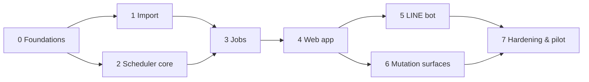

# WhereGo — Delivery Roadmap

Serial execution plan derived from [`../PLAN.md`](../PLAN.md). Last updated 2026-07-25.

**PLAN.md is the specification. These files are the execution order.** Where they disagree,
PLAN.md wins and the plan file is wrong — fix it rather than working around it.

---

## Shape of the build

Eight phases, executed **strictly in order**, one engineer. ~17 weeks / 4 months.

The ordering is not arbitrary. Three constraints fix it:

1. **Authentication runs through the custom domain.** Cloudflare Access is defined over a
   hostname in a zone you control and cannot protect `*.workers.dev` (§2, §10.7 step 0), so
   every authenticated surface in the system depends on the domain binding. **The domain is
   already registered in Cloudflare and the zone is active**, which removes the wall-clock risk
   this constraint originally carried — it is now an ordering rule *inside* Phase 0
   (P0-05 → P0-01 → P0-06) rather than a task that must start on day one. What is left to verify
   is that the zone and the Worker live in the **same Cloudflare account**.
2. **The scheduler is built before anything calls it.** `packages/scheduler` is pure — no
   Cloudflare, no D1, no `fetch`, no `Date` — so the entire constraint engine is verifiable in
   CI with zero infrastructure (§2, §11.4). Phase 2 produces a fully tested engine and a
   simulation harness before Phase 3 wires a cron to it.
3. **The §6 validator is Phase 2 work, not Phase 6 work.** It is pure logic over the same
   `PlanState`, shares `respectsCap` with the planner, and the nightly audit in Phase 3 needs
   it. Phase 6 only wires up surfaces (§12).

---

## Phase sequence

| # | Phase | Est. | Indicative weeks | Plan | Exit gate |
|---|-------|------|------------------|------|-----------|
| 0 | Foundations | 1 w | W1 · Jul 27 – Jul 31 | [`00-foundations.md`](00-foundations.md) | Green production deploy through the full CI→deploy chain; unauthenticated app route returns 403 |
| 1 | Import | 2.5 w | W2 – W4½ · Aug 3 – Aug 19 | [`01-import.md`](01-import.md) | Real `居家11506112.csv` imports to the expected patient count with no server-side patient data before Save |
| 2 | Scheduler core | 3 w | W4½ – W7½ · Aug 20 – Sep 9 | [`02-scheduler-core.md`](02-scheduler-core.md) | Every property test green, including *every due date is last-chance on exactly one run*; simulation passes at 38/100/330 |
| 3 | Jobs | 2 w | W7½ – W9½ · Sep 10 – Sep 23 | [`03-jobs.md`](03-jobs.md) | Crons run unattended for five consecutive days; a deliberately failed run produces a LINE push and a missed heartbeat |
| 4 | Web app | 3.5 w | W9½ – W13 · Sep 24 – Oct 16 | [`04-web-app.md`](04-web-app.md) | Doctor and nurse can run a full week — import, curate, review, move a visit — on a phone |
| 5 | LINE bot | 2 w | W13 – W15 · Oct 19 – Oct 30 | [`05-line-bot.md`](05-line-bot.md) | Morning push, full navigation tree, and 完成/未遇 all work against the **dev** channel end to end |
| 6 | Mutation surfaces | 1 w | W15 – W16 · Nov 2 – Nov 6 | [`06-mutation-surfaces.md`](06-mutation-surfaces.md) | A blocked drag offers a ranked resolution; every apply goes through the Durable Object |
| 7 | Hardening & pilot | 2 w | W16 – W18 · Nov 9 – Nov 20 | [`07-hardening-pilot.md`](07-hardening-pilot.md) | Backup restore drill completed; catch-up run approved by the doctor; pilot live |

Two phases end mid-week (1 and 2). Do not round them up into a buffer that quietly disappears —
the estimate already assumes no buffer, and §12 explains at length why an over-running plan lands
go-live in exactly the rush that makes the catch-up approval dangerous.

Phases 1 and 2 are the only pair with no hard dependency on each other — Import needs
`packages/domain` (`PlainDate`, ROC math, zod schemas), which Phase 1 builds and Phase 2 consumes.
They are still run serially because there is one engineer; if a second joins, this is the seam.

---

## Standing gates

These apply to every phase and are checked at every phase exit.

| Gate | Rule |
|------|------|
| **CI green before deploy** | `deploy.yml` fires on `workflow_run: [CI]` with `conclusion == 'success'`, never on `push: main` (§11.2) |
| **`Date` banned in the scheduler** | `no-restricted-globals` is a CI failure, not a lint warning (§2) |
| **Migrations expand-only** | They run before the new code. Drops and renames are two-release operations. A migration touching `patients` drops and recreates `schedulable_patients` (§3, §11.5) |
| **Never deploy during a plan run** | The `PlanCoordinator` lease blocks it; stale = `lease_until` passed (§11.5) |
| **No test patients in production D1** | Local Miniflare and the dev LINE channel only (§11.4) |
| **Every write through the Durable Object** | Reads may hit D1 direct. Writes may not (§6.5) |
| **Preview versions from Phase 0** | `wrangler versions upload` → smoke → `versions deploy`. The risky deploys are the early ones (§11.4) |
| **Six columns, never a seventh** | Any request to import 主診斷 / 照護階段 / 身分證號 is weighed against §9, not waved through (R13) |

---

## Open questions — the critical path nobody controls

Seven questions in §12 block confident execution. **All are cheaper to ask than to discover, and
three of them block work that starts in the first four weeks.** Ask all seven in the Phase 0
conversation with the clinic; do not stagger them to match the phase they block.

| # | Question | Blocks | Ask by |
|---|----------|--------|--------|
| 7 | Who is the named 個資 controller, and what retention rule? | §9.1, Phase 0 | **Week 1** |
| 3 | What are the last 41 rows of the sample file? | Phase 1 | **Week 1** |
| 4 | Will the clinic re-export with 地點? | Phase 1 | **Week 1** |
| 1 | Rolling 28-day window, or NHI 「每月至多2次」 calendar month? | §5.7, Phase 2 | **Week 3** |
| 2 | Is 61 days acceptable against 57 days of supply? Does 慢性病連續處方箋 limit how *early*? | §5.2, Phase 2 | **Week 3** |
| 5 | How does the doctor want leave handled? | §5.6, Phase 3 | Week 6 |
| 6 | How many LINE recipients, on which Taiwan OA tier? | Phase 5 | Week 11 |

Q1 changes `respectsCap` fundamentally. Q4 decides whether go-live scope is 38 patients or 38
patients plus a data-entry project of ~120 addresses that needs a named owner.

---

## Decisions still owed by the build

Not clinic questions — engineering decisions the plan deliberately leaves open. Each has a phase
where it must be closed, and each is called out in that phase's plan file.

| Decision | Close in | Note |
|----------|----------|------|
| Google Maps ToS: is lat/lng caching time-limited? | **Phase 0** | Schema gate, not a launch checkbox. If time-limited, `geocode_cache.fetched_at` gains a reader and the nightly job gains a re-resolve sweep (§4, §9) |
| API contract — endpoint list, error envelope | **Phase 4 step 0** | §7 and §8 specify screens in detail; there is no endpoint list. An afternoon's work, and it is what makes Phase 4 an estimate rather than a plan |
| Client-side `PlanState` sync for live drop-target validation | **Phase 4 step 0** | §6.7 requires drop targets to colour *before* release, which implies `preview` runs in the browser. The state-sync design is unspecified |
| Map / drag-and-drop / data-fetching libraries | **Phase 4 step 0** | |
| γ, λ, μ initial values | **Phase 2** | From the §5.8 simulation, not from intuition |
| Hard-delete procedure for 刪除權 | **Phase 0 (documented), Phase 7 (implemented)** | Soft delete cannot honour a deletion request (§9.1) |

---

## Known scope facts carried into every phase

- **The sample file yields 38 patients from 188 rows.** 129 rows have no 地點; of the 147 rows
  tagged 大寮衛生所 only 30 have an address (20%).
- **32 of 188 rows have no 出生日期, and R7 makes it required.** Those rows cannot be saved. The
  rule stands as written; the cost is recorded so the clinic can decide.
- **Two of the 38 have an expired 核定迄日** and are unschedulable under R12 until corrected.
- **Over half the go-live roster is already overdue** — 20 of 38 have a 預訪日期 3–59 days past.
  Phase 7's catch-up run is the highest-consequence human decision in the project.
- **The catch-up run synchronizes the cohort onto ~3 weekdays for the life of the system**, since
  56 days preserves weekday. This is why the last-chance test is reachability-based (§5.3) and
  why the simulation seeds a synchronized cohort.

---

## Risk register

| Risk | Phase | Mitigation in the plan |
|------|-------|------------------------|
| The existing zone is in a different Cloudflare account from the Worker | 0 | Checked in P0-01 **before** P0-03 buys Workers Paid on an account. A mismatch means no Workers Route and no Access hostname, and it is far cheaper to find at the start of the week than at P0-06 |
| Clinic cannot re-export with 地點 | 1 | Go-live scope drops to 38 patients and a named owner takes the data-entry project. Decide, don't drift |
| Q1 answered "calendar month" after Phase 2 starts | 2 | `respectsCap` is one named function in `packages/domain` with a property test against brute force. Changing it is hours, not days — provided nothing re-derives the rule at a call site |
| Phase 4 over-runs (the historical failure mode of this estimate) | 4 | Step 0 closes the four open engineering decisions before any component is written |
| Chinese New Year compresses a week of mandatory demand onto one 8-slot day | 3, 7 | Runs in the two weeks before a multi-day closure pull optional visits forward. Simulation includes a full CNY closure |
| Pilot lands in a rush and the catch-up run is approved without review | 7 | The approval screen requires the **doctor**, shows per-patient overdue days and resulting interval, and is written to `audit_log` in full |

---

## How to use these files

Each phase file is self-contained and execution-ready: prerequisites, numbered tasks with IDs,
acceptance criteria, and an exit gate. Task IDs are stable (`P3-07`) — reference them in commits
and in Linear.

Run one phase at a time. Do not start the next phase's tasks while the current phase's exit gate
is open; the gates exist because every one of them is a place where a defect becomes invisible
until it reaches a patient.
